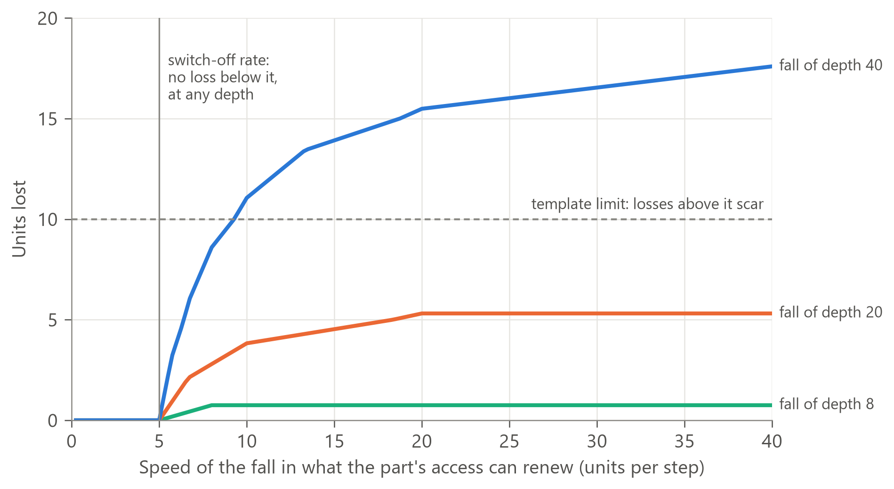

# Supplementary material

*Supplementary material for "From cells to councils: a conservation law of allocation under scarcity". Version 2 (in preparation, 8 October 2026). Version 1 as last posted is public record v1.3 (https://doi.org/10.5281/zenodo.23241491). Files named in the text are in the public record (see the repository README).*

## S1. Notation, supplementary propositions and proofs

**What this section holds:**
- **S1.0:** the notation for the whole paper.
- **S1.1 to S1.6:** as in version 1, apart from the notation (S1.0), the version 2 note under S1.1, one added sentence in S1.3, S1.4 restated with economising as a governor mode, S1.5 restated for the intake as a support part, and a condition added to S1.6 (what reaches the part at its turn).
- **S1.7 to S1.13:** the former main-text Propositions 5 to 11, moved here in version 2. Their numerical checks (S2) are unchanged, and S1.9 gains two. Apart from the notation (S1.0) and the version 2 terms: S1.7 gains a sentence on built-in access and its statement on strict priority is corrected; S1.10 drops an unsourced example; S1.9 and S1.13 are restated, the proofs of S1.11 and S1.12 adjusted, and S1.12's statement restated for the intake as a support part, for the version 2 order; S1.9 is also restated for the dependency lag, with a worked example; S1.8, S1.11 and S1.13 are reworded for repair as work like any other.

Main-text Propositions 1 to 4 are cited by their numbers.

### S1.0 Notation

Version 2 removes the symbol clashes of version 1; each change is listed in the last column.

| Symbol | Meaning | Change from version 1 |
|---|---|---|
| $t$; $i$, $j$; $r$; $s$ | Step; parts; resource; store | |
| $G$; $g$ | The governor; the access settings it sets | |
| $\Phi$ | The network's flow function: given access and the parts' work, the realised flow along the routes (the network) | |
| $F_i$; $\sigma_i$ | Part $i$'s state function; part $i$'s state | $\sigma_i$ was $s_i$, which clashed with the store index |
| $\pi_r$ | Order (priority) for resource $r$ | |
| $U_r$; $I_r$; $d_s$ | Supply through the intake; outside input; draw on store $s$ | |
| $S_r=U_r+I_r+\sum_sd_s$ | Flow available in a step | |
| $L_s$, $L$; $L_0$; $k_s$, $k$; $\rho_s=k_sL_s$ | Store level; starting level; release constant; release limit of store $s$ under proportional release (it releases up to $\rho_s$ per step) | |
| $q^0_{ir}$; $a_{ir}$; $\ell_{ir}=[q^0_{ir}-a_{ir}]_+$ | Reference allocation; allocation; shortfall | |
| $\Gamma_r=\sum_iq^0_{ir}-U_r$ | The gap | |
| $R_{\text{unused}}$; $X$ | Resource left unused; allocation above reference | |
| $N$; $P$; $D$ | The top's full need; the support parts' full draws (upkeep and work); the other parts' full draws | $D$ replaces version 1's $B$ (all basal maintenance) and $D_4$ (ordinary parts' work), with the version 2 order |
| $M$ | The margin: what can go unmet below the top before the protected flow moves | |
| $L^\ast=(\Gamma-M)/k$ | Store when the margin is used up (Proposition 3) | Kept; the refill level now has its own symbol |
| $L_w=\Gamma/k$; $T_{\text{lead}}$ | Store level at which release headroom reaches zero; lead time (S1.1) | |
| $K_i$ | Units of part $i$, in all states | Kept for units |
| $n_i$; $n^{\mathrm a}_i$ | Units present (active or switched off); active units | Defined; version 1 used $n$ in S1.3 without definition |
| $\theta$; $\theta_{\text{re}}$ | Switch-off share per step ($\theta K$ units a step); reactivation share | |
| $\tau_f$; $Q^\ast$ | Failure time; template limit as a share ($Q^\ast K$ units) | |
| $\varphi$; $\Delta$; $\Lambda$; $x$ | Speed and depth of a fall in renewable units; units lost; excess of active over renewable units (proof of S1.8) | |
| $w_i$; $w^0_i$; $\hat c_i$; $\epsilon$ | Work; reference work; effective capacity; economising share | |
| $A^w_{ir}$; $\kappa^w_{ir}$; $\kappa^n$; $\kappa^u$; $\kappa^b$ | Resource reaching work; requirement per unit of work; baseline renewal per active unit; wear per unit of work; basal maintenance per unit | |
| $a^b$; $u$; $m$; $y$; $\chi$ | Basal allocation; units broken down; resource recoverable per unit; overhead; funded share of basal maintenance (S1.3) | $\chi$ was $\beta$, which clashed with PT1's coefficient |
| $C$; $v_i$; $V_i$; $K^{\mathrm M}_i$ | Pool level; uptake; maximum uptake; half-saturation constant (S1.7) | $K^{\mathrm M}_i$ was $K_i$, which clashed with units |
| $\eta_i=q^0_i/V_i$; $C^\ast_i$ | Reference requirement as a share of maximum uptake; adequacy threshold (S1.7) | $\eta_i$ was $r_i$, which clashed with the resource index |
| $\Psi$; $c_S$; $\nu$; $\omega$; $L^{\mathrm r}$ | Distribution of past episode depths; cost per unit of a store being short; expected frequency of shortfall; best competing value of a part's binding units; refill level (S1.12) | Were $F$, $c_S$, $\rho$, $V$, $L^\ast$: four clashes removed |
| $W$; $\delta_j$ | The repair resource per step; the total requirement raised by damage to part $j$ (S1.13) | $\delta_j$ was $D_j$, which clashed with version 1's $D_4$ |
| $e$; $z$ | A route (S1.10); a split (S1.2) | |

**Kept, and distinct:** $M$ (the margin) and $m$ (S1.3); $w_i$ (work) and $W$ (the repair resource); $\hat c_i$ (capacity) and $c_S$ (a cost); $G$ and $g$; $C$ and $C^\ast_i$; $X$ (allocation above reference) and $x$ (S1.8's excess); $N$ and $n_i$; $U$ and $u$ (S1.3); $I$ and the index $i$; $S$ and the index $s$; $\Phi$ and $\varphi$; $\nu$ and $v_i$; $\omega$ and $w_i$. Each pair is a different letter or case, defined where it is used.

**S1.1 The G27 window (formerly: warning before the break), and its length.** Under proportional release ($\rho=kL$), with no outside input, and a constant gap $\Gamma$ with $M<\Gamma\le kL_0$:
- release headroom $kL-\Gamma$ falls linearly in time while the store meets the gap, and reaches zero at $L=\Gamma/k$. From then on, recovery from small perturbations of the protected flow cannot draw on the store and slows [withdrawn in version 2: see the note];
- the margin is used up after a lead time $T_{\text{lead}}\approx\ln\big(\Gamma/(\Gamma-M)\big)/\big(-\ln(1-k)\big)\approx k^{-1}\ln\big(\Gamma/(\Gamma-M)\big)$, which shortens as the gap grows relative to the margin and vanishes as the margin goes to zero. The break follows in that step without a delivery dependency, and one step later with one;
- under full release, headroom is constant until the store holds less than one step's release, so there is no slowing before the store empties.

*Proof.* Headroom is zero at $L_w=\Gamma/k$. Thereafter $L$ decays by the factor $(1-k)$ per step until $L<(\Gamma-M)/k$ (Proposition 3); the number of steps is $\ln(L_w/L^\ast)/(-\ln(1-k))$. ∎

*Note (version 2).* The first bullet put the slowing in the protected flow, which Proposition 2 says is silent before the break: once the store's headroom is used up, a fluctuation is met within the margin $M$, below the top, not from the protected flow. G12 was derived from this bullet and failed its first held-out test (main text, Section 5.1); the derivation is kept here as the statement that was tested. The arithmetic stands. Read in version 2's terms, the lead time is the length of the G27 window: the number of steps, between the store's headroom running out and the break, during which fluctuations in the gap show in the access of parts below the top (G27). With a delivery dependency the window is one step longer than the lead time. This reading is new in version 2.

**S1.2 The limit of rank under joint scarcity.** Two parts each need one unit of each of two complementary resources per unit of work; one unit of each is available; the orders conflict (part A first for resource 1, part B first for resource 2).
- Allocating each resource by its own order gives neither part any work.
- Every split $(z,1-z)$ of both resources gives total work 1 and is Pareto efficient. The two ordinal orders do not settle which of them results.

*Proof.* Under the law of the minimum, allocation by order gives A both units of resource 1 and none of resource 2, and B the reverse. Any common split gives work $z$ and $1-z$. ∎ Consistent with multi-resource allocation under Leontief preferences (Ghodsi A, Zaharia M, Hindman B, Konwinski A, Shenker S, Stoica I (2011), Dominant resource fairness: fair allocation of multiple resource types, Proceedings of the 8th USENIX Symposium on Networked Systems Design and Implementation). Where this case arises, the order of loss is set by the network, which must be mapped.

**S1.3 Shrinking when upkeep goes unpaid.** A part's upkeep is short only once its work draw has been cut to nothing, since what reaches a part covers its upkeep first. A part whose basal maintenance is short pays from its own units and loses $u=[\kappa^bn-a^b]_+/(\kappa^b+m/y)$ of them, where $m$ is the resource recoverable per unit broken down and $y\ge1$ the overhead. The remaining units are exactly funded, and $u\le n(1-\chi)$ (the unfunded share, with $\chi$ the funded share), with equality when units hold nothing usable.

*Proof.* $u$ solves $\kappa^b(n-u)=a^b+(m/y)u$. ∎ This is the DEB shrinking rule with absolute preference for reserve (Kooijman 2010, Sections 4.1.5 and 3.7.4, eq. 4.6).

**S1.4 Economising loses no units.** In the economising mode (a governor mode, documented in advance; not the default order), the access of every part outside the top and its supports is lowered by a share $\epsilon$ of its work draw, so work is cut evenly while what reaches each part still covers its upkeep first; it does not cut renewal. It therefore causes no unit loss at any speed. Its saving arrives at once for the work and its wear, $\sum_i(\kappa^w_i+\kappa^u_i)w^0_i\epsilon$ per step, and as idle units are switched off for their baseline renewal. Economising lowers access, not the reference; what goes unmet is still counted as shortfall. The reduced form serves the top's full need first and keeps it out of economising. Whether a top cuts its own work to keep its supports going, as neurons of the anoxia-tolerant turtle suppress their own firing (Hochachka et al. 1996), is left to a later version.

*Proof.* Units are lost only through unmet basal maintenance or renewal. Economising lowers the work draw, and with it the wear part of renewal need; the baseline need of units still active stays funded until they are switched off. ∎

**S1.5 The fuse.** The lowest-ranked part is the first to go short (Proposition 4). It is the last to come back only if its marginal value in recovery is also lowest, since recovery allocates by marginal value (S1.12). The intake's draw is the exception: it is a support part, so after refeeding its draw is served before every part outside the supports; its switched-off and lost units come back by marginal value, like any other part's.

**S1.6 Rising requirement.** For a part with switched-off units, rising requirement is met first within active capacity, then by reactivation at up to $\theta_{\text{re}}K$ per step at a cost. Output falls short only when the rise outpaces reactivation, reactivation cannot be paid for, requirement exceeds total capacity, or what reaches the part at its turn falls short of the raised requirement (Proposition 4).

*Proof.* Work is bounded by active capacity and by what reaches the part (main text, Section 3.4); reactivation is the only route from switched off to active, and it is rate-limited and paid from what is left in the flow. ∎

**S1.7 Rank under saturable uptake** (Proposition 5 in version 1). Parts take a shared resource by saturable uptake, $v_i=V_iC/(K^{\mathrm M}_i+C)$, from a pool at level $C$. Let $\eta_i=q^0_i/V_i$ be each part's reference requirement as a share of its maximum uptake. Part $i$ is adequately supplied if and only if $C\ge C^\ast_i=K^{\mathrm M}_i\eta_i/(1-\eta_i)$, so parts lose adequate access in descending order of $C^\ast_i$. Affinity ($K^{\mathrm M}_i$) alone decides the order only where $\eta_i$ is equal across parts. Priority approaches strict where neighbouring thresholds are far apart (S2), and parts go short together where they are close.

Rank is then a measurable property, fixed before outcomes. It combines affinity, capacity and requirement: a high-affinity part working near its maximum can lose adequate supply before a low-affinity part with large capacity and a small requirement. This connects the model's rank to Michaelis-Menten competition, to measured hierarchies of ATP consumers (Buttgereit and Brand 1995) and to triage by binding affinity (Ames 2006). It is the formal case of access built into the parts: a built-in setting is fixed within a mode, and a change in a part's requirement can move its place (main text, Section 3).

*Proof.* $V_iC/(K^{\mathrm M}_i+C)\ge q^0_i$ rearranges to $C\ge K^{\mathrm M}_iq^0_i/(V_i-q^0_i)=C^\ast_i$. The pool level falls monotonically with supply, so parts cross their thresholds in descending order of $C^\ast_i$. With $\eta_i$ equal, $C^\ast_i\propto K^{\mathrm M}_i$. With thresholds far apart, at most one part is near its threshold at any $C$ (close to strict); otherwise several are short together (shared). ∎

**S1.8 Rate decides harm** (Proposition 6 in version 1). For a renewable part with basal maintenance met and its route back intact, let the units its access can renew fall by $\varphi$ per step to a depth $\Delta$.
1. If $\varphi\le\theta K$, no units are lost at any depth.
2. If $\varphi>\theta K$, the loss satisfies $\Delta(1-\theta K/\varphi)-\tau_f(\varphi-\theta K)\le\Lambda\le\Delta(1-\theta K/\varphi)$.
3. A scar is possible only if $\Delta(1-\theta K/\varphi)>Q^\ast K$, and certain if the lower bound exceeds $Q^\ast K$.

Depth without speed never harms; speed without depth never scars; a scar needs both, and the threshold depth falls as speed rises (Figure S1). Fixed capital ($Q^\ast=0$) is scarred by any fall faster than its switch-off rate.

**Figure S1. Rate decides harm (S1.8), simulated.** A part of $K=100$ units, with its upkeep met and its route back intact, switch-off rate $\theta K=5$ units a step and failure time $\tau_f=4$ steps, faces a fall in the units its access can renew, of depth $\Delta$ (8, 20 or 40) and speed $\varphi$. Below the switch-off rate no units are lost at any depth. Above it, losses rise with speed, and further the deeper the fall; only the deepest fall crosses the template limit $Q^\ast K=10$, beyond which losses scar. Parameter values are illustrative. (Figure 4 in version 1.)

*Proof.* Over the episode, switched-off and lost units together number $\Delta$. During the decline, which lasts at least $\Delta/\varphi$ steps, the excess $x$ of active over renewable units satisfies $x_{t+1}=(x_t-\theta K)(1-1/\tau_f)+\varphi\ge\varphi>\theta K$, so $\theta K$ units are switched off each step and at least $\theta K\Delta/\varphi$ in all: hence the upper bound. At the end of the decline the excess is at most $\theta K+\tau_f(\varphi-\theta K)$, and no more can be switched off in the tail: hence the lower bound. If $\varphi\le\theta K$, every unit not renewed is switched off within the step. ∎

**S1.9 Exhaustion, severance and constriction** (Proposition 7 in version 1). Let delivery to the top and its supports be bounded by pathway capacity, the minimum cut between source and part (Ford and Fulkerson 1956). If, in a step in which the support parts were met in the step before and no unit of the top or a support part is still coming back from an earlier shortfall, the protected flow falls while a part outside the top and its supports still draws anything, or a store still has release headroom, then either the minimum cut to the top or a support part is below its need (severance at zero, constriction above zero), or damage from outside has removed units of the top or a support part.

Failure while a part outside the top and its supports is still supplied, with the supports met in the step before and no unit of the top or a support part still coming back, identifies a cut or narrowed link, or outside damage. Each is observable independently. Where the supports were short in the step before, the top can be short while every other part draws in full: that is the dependency lag, counted at the top, not a break in the order. The earlier support shortfall must be observed, not inferred from the later one. Where units of the top or a support part, switched off or lost in an earlier shortfall, are still coming back, the top can be short while every other part draws in full: that is the recovery lag. It is not a break in the order, and the earlier shortfall must be observed, not inferred from the later one (worked example in S2).

*Proof.* If a part outside the top and its supports still draws anything, then $S\ge N+P$, since the version 2 order serves the top and then the supports in full before any other part; a store with headroom releases the whole gap, so again $S\ge N+P$. With the supports met in the step before, delivery to the top is not limited by the dependency. So the flow could meet the top and its supports. If they are short, another bound binds: the pathway, whose capacity is the minimum cut, or their own capacity, which falls only through an earlier shortfall, whose units would still be coming back (excluded), or through damage. ∎

**The dependency lag, a worked example.** The top needs 10; one support part draws 3 (upkeep 1, work 2); three other parts draw 3 each. Delivery to the top in a step is in proportion to the support part's work in the step before. In step 1, with the support met in step 0, supply is 11: the top receives 10, and the support 1, which covers its upkeep and leaves no work; the other parts receive nothing. In step 2 supply is 22, enough for every draw: the support and the other parts draw in full, but delivery to the top is 10 × 0/2 = 0. The top is short while every other part draws in full, with no cut and no damage. The cause is the support shortfall in step 1, which must be observed (S2 checks this case and the restated results).

**S1.10 Rerouting** (Proposition 8 in version 1). A pathway with parallel routes loses route $e$. If its flow is reallocated where there is headroom, no surviving route is overloaded if and only if the surviving headroom covers the lost flow. If flow divides by a physical rule (in proportion to conductance), a surviving route can be overloaded even when total headroom suffices. Where a collateral joins two parts' branches, flow reaching one through it is taken from the other at fixed supply (steal).

Cascades and steals are expected in physically divided networks (vessels, pipes, power lines) even with spare capacity, and in networks where flow is placed by access settings (budgets, routers) only when total capacity is short. A budget moved to a channel with room is an instance of the second.

*Proof.* Placing the lost flow into surviving headroom succeeds exactly when the headroom suffices; in a general network this is max-flow min-cut. By example: routes with capacities 10, 4 and 10 carry 5, 3.9 and 5. Losing the first leaves headroom 5.1 for flow 5, but a split in proportion to capacity sends about 1.43 to the second route, which then carries 5.33 against capacity 4. At fixed supply, conservation at a junction means flow leaving one branch through a collateral is subtracted from it. ∎

**S1.11 Collapse, not death** (Proposition 9 in version 1). A system outside its viable set is inside the capture basin (Aubin 1991), so in collapse rather than death, if:
- supply, including outside input, can return to and be held above the top's need, every surviving part's basal maintenance and, where the top depends on them, the support parts' draws, with a positive remainder for rebuilding;
- the top is not scarred below what the protected flow requires;
- every non-bypassable link the protected flow depends on has capacity above zero or can be restored;
- every part the protected flow depends on has its template intact and its route back open;
- any part whose work produces a resource that rebuilding needs (for example, bone marrow) has positive capacity, or can itself be restored.

The time to re-enter the viable set is at least the longest rebuild time among those parts. The conditions are measurable before the outcome.

*Proof.* Under the first condition an access setting exists that fully funds the top and its supports and gives every other surviving part access equal to its upkeep, which what reaches it covers first, so the top and its supports lose no further units (Proposition 4 and S1.8). Other parts may still lose units, but the protected flow does not depend on them. The positive remainder funds rebuilding, and under the remaining conditions each needed part is rebuilt at its rebuild rate. The system therefore reaches the viable set in finite time and can stay there: membership of the capture basin. ∎

**S1.12 Recovery order and partial refill** (Proposition 10 in version 1). The intake is a support part, so after refeeding its draw is served before every part outside the supports; its switched-off and lost units, like every part's, come back from what is left by marginal value. With $\Psi$ the distribution of past episode depths, $c_S$ the cost per unit of a store being short, $\nu$ the expected frequency of shortfall and $\omega$ the best competing value of a part's binding units, the store refills to $L^{\mathrm r}=\Psi^{-1}(1-\omega/(c_S\nu))$ if $\omega<c_S\nu$, and not at all otherwise.

While parts still bind, a store refills only part way, to $L^{\mathrm r}$, which is higher the more frequent ($\nu$) and the deeper ($\Psi$) past shortfalls have been; where $\omega\ge c_S\nu$ it does not refill at all. The refill level is the newsvendor critical fractile; the allocation rule is marginal analysis of spares (Sherbrooke 1968).

*Proof.* The intake is a support part, drawn in step 2 of the ordered draw, before every part outside the supports; reactivation and rebuilding are paid from what is left, by marginal value (main text, Section 3.3, step 4). A store's marginal value $c_S\nu(1-\Psi(L))$ is non-increasing in $L$; greedy allocation by marginal value stops refilling where it falls to $\omega$, the stated quantile. Greedy allocation is optimal for separable concave value (Ibaraki and Katoh 1988). ∎

**S1.13 Repair under strict rank** (Proposition 11 in version 1). This is the ordered draw with a limited repair resource as the flow. Let the repair resource be $W$ per step and binding, and let damage raise the requirement of parts by totals $\delta_j$, indexed in rank order; damaged parts draw on the resource by rank. Part $i$ finishes healing at step $\lceil\sum_{j\le i}\delta_j/W\rceil$. The highest-ranked damaged part heals as fast as alone; each lower-ranked part is delayed by the damage ranked above it. A smaller $W$ never shortens a finishing time, and can lengthen it.

Strict-rank repair is distinguishable from shared repair: under strict rank, the highest-ranked damaged part does not slow when others are damaged too.

*Proof.* Under strict priority, the cumulative repair resource drawn after $t$ steps is $tW$, applied to damage in rank order; part $i$ is complete when $tW\ge\sum_{j\le i}\delta_j$. ∎

## S2. Numerical checks

**What was checked.**
- Every quantitative statement in the main text, and every result in S1 except S1.5, S1.6 and S1.11, was checked numerically against an independent implementation of the reduced form (Section 3.3 of the main text).
- The implementation was written from the equations, not from the simulation engine used during the model's development.
- It covers one resource:
  - one step of the ordered draw, in version 2's order: the top's need, then the support parts' full draws, then every other part's full draw, each in rank order, with upkeep before work inside each part (version 1's order and the alternative considered in version 2, below, are kept as records);
  - the two store-release forms;
  - unit switch-off and failure;
  - saturable uptake;
  - strict-rank repair.

**Design.** Each check draws random instances from stated ranges and tests the proposition's statement on every instance. A single failure prints the counter-example. The seed is fixed (20261007), so every run is identical. The code uses only the Python standard library.

**Result: every check passes, and the alternative order fails the version 2 checks, as it should.**

| Result | What is tested | Instances | Outcome |
|---|---|---|---|
| Proposition 1, scarcity regime | The ledger closes (gap = store draw + total shortfall). Total shortfall is unchanged when the support parts and the other parts are randomly re-ranked, and under the alternative order, at fixed supply and store draw | 2,000 (one top, two support parts and six other parts, each with upkeep and work; supply uniform up to total need) | Pass |
| Proposition 1, general identity | $\sum\ell=\Gamma-\sum d-I+R_{\text{unused}}+X$ with gates closed at random (probability 0.3) and allocation up to 1.5 times reference | 2,000 (five parts) | Pass |
| Proposition 2 | The top is met if and only if $S\ge N$; the supports if and only if $S\ge N+P$ | 2,000 | Pass |
| Proposition 2, with outside input | In terms of the gap, with outside input $I$ drawn at random: the supports are met if and only if $\Gamma\le\sum d+I+D$, and the top if and only if $\Gamma\le\sum d+I+P+D$ | 2,000 | Pass |
| Proposition 3 | Without the delivery dependency: under proportional release the store left at the break lies between $(1-k)L^\ast$ and $L^\ast$, with $L^\ast=(\Gamma-M)/k$. Under full release, less than one step's gap is left. A faster gap leaves more store unused (gaps 1.5, 2, 3 and 4). A gap at or below the margin never breaks | 500 ($L_0$ 50 to 200; $k$ 0.01 to 0.2; $M$ 0 to 5; gap between $M+0.1$ and $kL_0$), plus fixed cases | Pass |
| Proposition 3, S1.1 and G27, by simulation | The full draw with one store, half the cases with the delivery dependency ($M=D$) and half without ($M=P+D$), measured to the step at which the margin is used up (with the dependency, the first step the support parts go short; the protected flow breaks one step later): store left then between $(1-k)L^\ast$ and $L^\ast$; lead time within one step of the formula; nothing short while the store has headroom; the first part not fully supplied never moves down the order; the top and the support parts stay met until the margin is used up | 400 | Pass |
| Proposition 4 | Parts short of their draw form a lower segment of the whole rank order (top, supports, others); no part is short while a lower-ranked part draws anything; within a short part, no work is drawn while upkeep is short | 3,000 | Pass |
| Propositions 2 and 4 and S1.9, across steps, and the dependency lag | Runs of six steps with random supply (some steps at full supply), and delivery to the top in proportion to the support parts' work in the step before; what the cap holds back is either not delivered or left in the flow. In every step whose supports were met in the step before: the top is met if and only if $S\ge N$, the order holds (Proposition 4), and the top is never short while a part outside the top and its supports draws (S1.9, with no cut or damage). The dependency lag must occur, and the worked example in S1.9 is reproduced | 3,000 runs, both variants; 2,547 lag steps found | Pass |
| Propositions 2 and 4 and S1.9, across steps, with unit states, and the recovery lag | The top and one support part made of units: a unit whose work goes unmet is switched off (up to a set number a step), takes upkeep only and does no work, and comes back at up to a set number a step, paid from what is left; random supply over ten steps, with and without the delivery dependency. In every step in which the support parts were met in the step before and no unit of the top or a support part is still coming back: the top is met if and only if $S\ge N$, and the top and the supports are never short while a part outside them draws. Otherwise the recovery lag must occur. The worked example (from the final check): a top of 10 units (upkeep 0.2 and work 0.8 each), one support part of 3 (upkeep 1, work 2) and three other parts of 3, switch-off 5 units a step and reactivation 1; supply 22, then 6, then 22: the protected flow is 6.8, 7.6, 8.4 and 9.2 of 10 in steps 3 to 6, with the support met in the step before and every other part met in full | 3,000 instances, each with and without the dependency; 210 recovery-lag steps found | Pass |
| The alternative order, fed to the Proposition 4 and G27 checks | The order that keeps every other part's upkeep ahead of any other part's work (considered and not adopted in version 2): the checks must fail | 3,000 and 100 | Fail, as required (1,719 and 100 failures) |
| S1.7 (was Proposition 5), strict limit | With four parts of equal capacity and half-saturation constants spaced by factors $R=10^2, 10^4, 10^6$, saturable uptake departs from strict priority by at most 0.15, 0.02 and 0.002 at five supply levels. Shares fall with the half-saturation constant | Fixed cases | Pass |
| S1.7 (was Proposition 5), adequacy order | Parts lose adequate supply in descending order of $C^\ast=K^{\mathrm M}\eta/(1-\eta)$. Counter-example to affinity alone: $V=(1,10)$, $K^{\mathrm M}=(1,10)$, $q^0=(0.9,0.5)$; the higher-affinity part loses adequate supply first | 200 random three-part cases (near-ties, with $\lvert\ln(C^\ast_i/C^\ast_j)\rvert<0.05$, skipped), plus the counter-example | Pass |
| S1.8 (was Proposition 6) | A fall in renewable capacity no faster than $\theta K$ loses no units. A faster fall loses between $\Delta(1-\theta K/\varphi)-\tau_f(\varphi-\theta K)$ and $\Delta(1-\theta K/\varphi)$ | 400 ($K=100$; $\theta$ 0.02 to 0.2; $\tau_f$ 2 to 10; $\varphi$ 0.2 to 40; $\Delta$ 5 to 90) | Pass |
| S1.10 (was Proposition 8) | When a route is lost, reallocating its flow into headroom overloads a surviving route if and only if total headroom is less than the lost flow. A split in proportion to capacity overloads a route in at least one case with enough headroom | 2,000 networks (three to six routes, capacities 1 to 10) | Pass |
| S1.12 (was Proposition 10) | Refilling a store unit by unit while its marginal value exceeds the best competing value $\omega$ stops within 0.2 of the critical fractile $\Psi^{-1}(1-\omega/(c_S\nu))$. There is no refill when $\omega\ge c_S\nu$ | 500 past episode depths (exponential, mean 20); $c_S=10$, $\nu=0.4$; five values of $\omega$ | Pass |
| S1.13 (was Proposition 11) | Under strict rank each damaged part finishes at step $\lceil\sum_{j\le i}\delta_j/W\rceil$. The highest-ranked damaged part heals as fast as alone | 1,000 (five parts; $W$ 0.5 to 5; damage 0 to 10) | Pass |
| S1.1 | Without the delivery dependency, the G27 window, from the store's headroom running out to the break, is within one step of $\ln(\Gamma/(\Gamma-M))/(-\ln(1-k))$ | 500 (ranges as for Proposition 3) | Pass |
| S1.2 | Allocating each of two complementary resources by its own conflicting order gives no work. Every common split gives total work 1 | Exact case | Pass |
| S1.3 | After shrinking, the remaining units are exactly funded, and the loss is no larger than the unfunded share | 2,000 | Pass |
| S1.4 | Economising at any speed leaves renewal fully funded. Its first-step saving equals $(\kappa^w+\kappa^u)w^0\epsilon$. Consolidation brings active units down to the economised work | 300 ($\theta$ 0.02 to 0.2; economising depth 0.1 to 0.9; speed one to ten steps) | Pass |

**Not checked numerically.** These follow directly from the definitions, so a numerical check would only restate them:
- S1.11 (was Proposition 9), a constructive condition for re-entering the viable set;
- S1.5 and S1.6.

The code also checks one result that is not used in this paper: a drain treated as a cut in supply. It belongs to the proposed nested-systems extension.

**Corrections the checks and review made.** Each was confirmed numerically after it was found, except item 6 (S1.11), which is not checked numerically (above):
1. **S1.8 (then Proposition 6):** the loss expression $\Delta(1-\theta K/\varphi)$ was first stated as an estimate. The checks showed it is an upper bound, and the lower bound was added.
2. **Economising:** an earlier statement implied that fast economising causes unit loss. The checks (S1.4) showed it does not: economising cuts work, not renewal.
3. **Proposition 1:** total shortfall was first stated as invariant to access in general. Review showed this holds only where the flow is fully used and no part receives above its reference. The proposition now states two regimes, and the general identity (with $+X$, not $-X$, as first written) is checked.
4. **S1.7 (then Proposition 5):** rank under saturable uptake was first attributed to affinity alone. Review showed it depends on capacity and requirement as well, and the counter-example above is now part of the check.
5. **Proposition 2 (outside review):** the silence condition left out outside input. It is now $\Gamma\le\sum_sd_s+I+M$. With random outside input, the earlier condition gave the wrong answer in 622 of 2,000 cases; the corrected one passes all 2,000 (table above).
6. **S1.11 (then Proposition 9; outside review):** the first condition funded the top and basal maintenance but not the support parts the top depends on, nor the repair parts, so it did not guarantee recovery. The condition now requires both, with a positive remainder for repair. A condition that the repair parts have capacity, or can be restored, was added, and the proof was revised. (Version 2 withdraws repair parts: the remainder funds rebuilding, and the capacity condition applies to any part whose work produces a resource that rebuilding needs.)
7. **Phase order (version 2):** changed to rank first, part by part (the top, then the support parts in full, then every other part in full, in rank order; upkeep before work inside each part). Propositions 2 to 4, S1.1 and G27 were re-derived and rechecked; version 1's order, and the alternative considered, are kept in the code as records.
8. **Propositions 2 and 4 and S1.9 (final check, version 2):** the statements failed when a support part was partly supplied, or short in the step before. They are restated for steps in which the support parts were met in the step before, with the dependency lag named, and checked (table above).
9. **Propositions 2 and 4 and S1.9 (final check, version 2, second round):** the statements failed while units of the top or a support part were still coming back after an earlier shortfall. The guard now excludes such steps, the recovery lag is named, and the check gains unit states (table above).

**Faults in the checks themselves, fixed before the results above:**
- the generator for Proposition 3 produced gaps below the margin, which cannot break, so those cases are now excluded by construction;
- the uptake solver's search range was too narrow for widely spaced half-saturation constants, so it now bisects on the logarithm of the pool level;
- one check for rising requirement tested nothing and was removed.

**Code and output.**
- Code: `scripts/pam_propositions_check.py`.
- Output: `scripts/pam_propositions_check_output.txt` (every check "ok"; "ALL OK"). The version 2 checks are `check_P1_v2b`, `check_P2_v2b`, `check_P4_v2b`, `check_P3_S11_G27_v2b` and `check_lag_v2b`; the checks with working labels P1 to P18 below are version 1's, kept as its record.
- To run: `python scripts/pam_propositions_check.py`.
- The script's own comments use working labels P1 to P18:

  | Paper result | Working label |
  |---|---|
  | Proposition 1 | P1 |
  | Proposition 2 | P2 |
  | Proposition 3 | P4 |
  | Proposition 4 | P3 |
  | S1.7 (was Proposition 5) | P17 |
  | S1.8 (was Proposition 6) | P6 |
  | S1.9 (was Proposition 7) | P8 |
  | S1.10 (was Proposition 8) | P13 |
  | S1.11 (was Proposition 9) | P15 |
  | S1.12 (was Proposition 10) | P9 |
  | S1.13 (was Proposition 11) | P10 |
  | S1.1 | P5 |
  | S1.2 | P16 |
  | S1.3 | P7 |
  | S1.4 | P11 |
  | S1.5 | P12 |
  | S1.6 | P14 |

## S3. Prior theories against the model's features

Each row is a theory or family of models; each column is a feature of the model (main text, Section 3); only the seven components of Section 3.1 are called components. Table 1 of the main text condenses this table.

**Codes:**
- **F:** present in formal (mathematical) form.
- **W:** stated in words.
- **E:** measured, without a general model.
- **p:** partial, or a different form (see the note).
- **·:** not found in what was read.
- **?:** not checked.
- **T:** a pre-registered test result (Tst column only).
- **†:** the row rests on abstracts only and is provisional.
- **Bold** (This model row): no other row has an F in that column (for Tst, a T).

How much of each source was read is listed after the notes.

**Columns:**

| Column | Feature |
|---|---|
| Gov | A governor that regulates access, with modes and gates |
| Acc | Order of loss set by access (transport, gating, affinity, pathway), per resource |
| Pre | That order fixed beforehand from documented access, then tested |
| Sto | Stores drawn first; a protected floor; intake held or raised |
| Uni | Units active, switched off, lost or scarred |
| Rep | Repair competing for access |
| Led | A conserved ledger of shortfall: unmet requirement counted at each part, which no setting of access removes outside the named exceptions (Proposition 1), including what the protected flow does not show |
| Via | Viability: collapse against death; a threshold switch before passive failure |
| Scr | Scars and the template (lasting residue; replacement needs a template) |
| Res | More than one resource |
| Sys | Systems other than bodies |
| Tst | Pre-registered tests |

| Theory | Gov | Acc | Pre | Sto | Uni | Rep | Led | Via | Scr | Res | Sys | Tst |
|---|---|---|---|---|---|---|---|---|---|---|---|---|
| Dynamic Energy Budget theory (Kooijman 2010) | p¹ | p² | · | F | · | · ³ | p⁴ | F⁵ | p⁶ | F | · ⁷ | · |
| Selfish Brain (Peters et al. 2004; Peters and Langemann 2009; Göbel and Langemann 2011; Peters, McEwen and Friston 2017) | F | F⁸ | p⁹ | F | · | · | p¹⁰ | · | · | · | · | T¹¹ |
| Energetic model of allostatic load (Bobba-Alves, Juster and Picard 2022) | W | W¹² | · | W | · | W⁵⁵ | W¹³ | · | W | · | · ¹⁴ | · |
| Brain-body energy conservation model (Shaulson, Cohen and Picard 2024)† | W | W | · | ? | · | ? | ? | ? | W | · | · | · |
| Plant hierarchical models (Grossman and DeJong 1994; reviewed by Lacointe 2000 and Marcelis and Heuvelink 2007) | · | · ¹⁵ | · | p | p¹⁶ | · | p⁴ | · | · | p | · | · |
| Plant transport-resistance models (Thornley 1972; Minchin, Thorpe and Farrar 1993; Minchin and Lacointe 2005)† | · | F¹⁷ | · | p | · | · | p⁴ | · | · | p | · | · |
| Functional equilibrium in plants (as reviewed by Marcelis and Heuvelink 2007) | p¹⁸ | · | · | F¹⁹ | · | · | · | · | · | F | · | · |
| Allostasis (Sterling 2012, 2018; Schulkin and Sterling 2019) | W | · ²⁰ | · | W | · | W²¹ | W²² | · | W²³ | W | W²⁴ | · |
| Central governor (Noakes 2000, 2012) | W | · | · | W²⁵ | W²⁶ | · | · | W²⁷ | · | W | · | · |
| Selfish immune system (Straub 2014) | W²⁸ | W²⁹ | · | W³⁰ | · | W | W³¹ | W³² | W | · | · | · |
| Hypoxia tolerance (Hochachka et al. 1996)† | W | · | · | ? | W³³ | W³⁴ | · | W³⁵ | · | · | · | · |
| Triage theory (Ames 2006; McCann and Ames 2009, 2011) | · ³⁶ | W³⁷ | p³⁸ | W³⁹ | p | W⁴⁰ | W⁴¹ | · | W | W⁴² | · | · |
| Hierarchy of ATP consumers (Buttgereit and Brand 1995)† | · ⁴³ | E/F⁴⁴ | · | · | · | E⁴⁵ | · | · | · | · | · | · |
| Haemodynamic models (Guyton, Coleman and Granger 1972; Hester et al. 2011; Barnes et al. 2020; Curcio et al. 2020)† | F⁴⁶ | F⁴⁷ | · | F⁴⁸ | · | · | p⁴ | p⁴⁹ | · | p | · | · |
| Fetal brain-sparing models (Luria et al. 2012; Garcia-Canadilla et al. 2014)† | p | F | · | · | · | · | · | · | · | p | · | · |
| Maintenance-Growth Model (Mauritsson and Jonsson 2023) | · | · | · | F⁵³ | · | F⁵⁴ | p⁴ | · | · | · | · | · |
| Disposable soma (Kirkwood 1977; Drenos and Kirkwood 2005)† | · | · ⁵⁰ | · | · | · | F⁵⁰ | · | p | p | · | · | · |
| Ultrastability (Ashby 1952) | p⁵⁶ | · | · | · | · | · | · | W⁵⁷ | · | · | p⁵⁸ | · |
| Perceptual control theory (Powers 1973)† | F⁵¹ | · | · | · | · | · | · | · | · | · | ? | · |
| Free energy principle (Friston 2010, 2013)† | p⁵⁹ | · | · | · | · | · | · | p⁶⁰ | · | · | p⁶¹ | · |
| **This model** | F | F | **F** | F | **F** | F | **F** | F | **F** | F | **F** | T⁵² |

**Notes**
1. DEB adds control species by species; the κ rule is fixed, not governed.
2. DEB's account of κ through carrier densities, and its synthesising units, are access-like at the receiving end.
3. DEB has no repair process: damage is irreparable. Defence sits in maturity maintenance, which is "more facultative" than somatic maintenance (cut first).
4. Mass and energy (or carbon, or fluid volume) are conserved, but there is no account of which parts go short.
5. Death at a structural floor; hazard from ageing.
6. Ageing damage accumulates; replacing damaged cells needs undifferentiated cells (the model's template), stated but not modelled as a scar rule.
7. All organisms, but not organisations.
8. Insulin-gated access: insulin-dependent (GLUT4) against insulin-independent (GLUT1) uptake, in two compartments.
9. Predictions are fixed beforehand and set against a rival theory, but the order is the theory's premise, not derived from access resource by resource. Each model term is assigned one documented mechanism (Peters and Langemann 2009, Table 1), close to the model's mapping step.
10. The supply-chain model is formal and energy-conserving: unmet flow "propagates retrograde" and builds up in front of the bottleneck (fat, blood glucose). Sprengell, Kubera and Peters (2021b) read post-stroke hyperglycaemia as the brain's own pull on supply. Supplement S10.1 sets out why the related trial is not support. Peters, McEwen and Friston (2017) state in words that, if the brain cannot reduce uncertainty, a persistent cerebral energy crisis may develop that burdens the individual as allostatic load.
11. Pre-registered systematic reviews (PROSPERO) of the theory's predictions against a rival theory (Sprengell, Kubera and Peters 2021a, 2021b).
12. "The most urgent processes divert or steal energy from less urgent ones": urgency, judged after the fact.
13. The cut to growth, maintenance and repair can occur "without elevating total energy expenditure", visible only in molecular sequelae.
14. The same process at whole-body, cellular and mitochondrial levels: nested levels, not other kinds of system.
15. Strict priority among organ groups, but the sequence is assigned, not derived from access.
16. Fruit abortion at a low source-sink ratio, the nearest thing to a loss rule.
17. "Sink priority being an emergent property of the model" (Minchin and Lacointe 2005), arising from transport resistance and sink kinetics.
18. Teleonomic: the plant behaves as if seeking a root-shoot balance.
19. Shortage of a resource shifts allocation to the organ that takes it in, as the model's intake is held.
20. "To each organ according to its need": priority set by the brain's prediction of need, not by access.
21. An anabolic (grow and repair) mode set by the circadian clock.
22. Sterling describes treated hypertension as each blocked route moving the load to the next, until the cost lands on exercise (Sterling 2018); the wording is his.
23. Arteries thicken and stiffen, and the system loses the ability to return to normal pressure.
24. Society and the planet as regulated systems: an essay argument, not a mapping.
25. Exercise always ends with a reserve: 35 to 60% of muscle recruited.
26. Motor units are recruited and de-recruited.
27. Exercise is stopped "before there is a catastrophic failure of homeostasis": an active switch before passive failure.
28. Two co-equal regulators, brain and immune system, each able to take control and inhibit the other. In this model they are two modes of one governor function, selected by signals; which mode wins in conflict is an open question.
29. Insulin dependence decides which organs gain from insulin resistance.
30. A non-negotiable floor (about 8,500 kJ a day) and a negotiable remainder; stores last 19 to 43 days.
31. Energy arithmetic of the reallocation (kJ a day), not a conserved account of unmet requirement.
32. Acute programmes must end within the store's time; chronic activation is "a misguided acute program".
33. Channel arrest, spike arrest and translational arrest.
34. Protein synthesis, one of the cell's ATP consumers, is cut (translational arrest).
35. Arrest is reversible in tolerant cells and "irreversible" in sensitive cells.
36. No central regulator: the mechanism is distributed (binding affinities, isozymes, distribution).
37. Binding affinity, transporters, preferential distribution, and a selenium-sensitive tRNA.
38. Essentiality is classified first, from knockout lethality, then checked against the order of loss (vitamin K-dependent proteins, selenoproteins). The classification is not by access and was not pre-registered.
39. Transport proteins are induced first ("homeostatic adjustments"), then triage follows.
40. DNA-repair enzymes lose to enzymes of ATP synthesis.
41. "Insidious changes accumulate" while critical functions stay intact: the cost does not show in them.
42. About 40 micronutrients; worked through for vitamin K, selenium and iron.
43. Control is "widely shared"; no block has more than a third of it.
44. A measured order (macromolecule synthesis, then sodium cycling, then calcium cycling, then proton leak), analysed by metabolic control analysis.
45. Among the cell's ATP consumers, protein and RNA/DNA synthesis are the most sensitive to supply.
46. Baroreflex and other control loops in formal models.
47. The regional order emerges from bed resistances, reflex gains and autoregulation, calibrated to data.
48. Venous unstressed volume is mobilised as a store.
49. Time to cardiovascular collapse.
50. Repair investment is set by optimisation (fitness), not by access.
51. Hierarchical control: higher levels set the reference levels of lower ones.
52. PT1 (main text, Section 5.1): pre-registered and adjudicated blind; one supported result, at half weight.
53. Non-negotiable basal maintenance and feeding costs are paid first; negotiable maintenance and growth share the rest.
54. Negotiable maintenance (defence: immune system, buffering) is cut as a power of relative food intake.
55. Repair competes with growth and maintenance for the energy that allostasis leaves, stated in words; no order among them is stated.
56. Essential variables are held within physiological limits by adaptive behaviour (Sections 3/14 and 5/3): targets on sensed levels, not a regulator of access.
57. Survival is staying within a region of the phase space (Section 5/9). Step-functions change value at critical states nearer the normal values than the limits (Sections 9/1 and 9/5): a switch before failure, stated mostly in words in the sections read.
58. The homeostat, a machine built to the definition of the ultrastable system (Section 8/8), as well as the organism.
59. Internal states appear to minimise free energy (surprise) through perception and action: regulation of the system's own states, with no shared resource or ranked access.
60. Persistence as preserving functional and structural integrity, with homeostasis as a consequence (Friston 2013).
61. Any (ergodic) random dynamical system with a Markov blanket, by a heuristic proof with simulations that "suggests" it (Friston 2013); read as an abstract only.

**What the table shows.**
- **Every column is filled by some prior theory, most often in words or in part;** no prior theory has Pre, Uni, Led, Scr or Sys in formal form. The model's governor, access-based order, stores, units, repair competing for access and scars each appear elsewhere.
- **No prior theory has more than three columns in formal form,** and the fullest row (triage theory) fills eight of twelve, mostly in words or in part. The nearest are:
  - the Selfish Brain: formal and tested, but one resource and two compartments;
  - the selfish immune system: in words, energy only, two regulators;
  - triage theory: in words, many resources, several levels.
- **Five columns have no formal entry in any prior theory** (Table 1 shows three of them):
  - **Pre:** a rank fixed beforehand from documented access and then tested. Triage theory (by essentiality, not access) and the Selfish Brain (as a premise, not derived) come closest.
  - **Uni:** units active, switched off, lost or scarred. Stated in words for the central governor and hypoxia tolerance, and in part in plant hierarchical models and triage theory.
  - **Led:** a conserved account of which parts go short. It is stated in words by the energetic model of allostatic load, by allostasis, by the selfish immune system and by triage theory, but never kept as an account.
  - **Scr:** scars and the template. Stated in words by the energetic model of allostatic load, the brain-body energy conservation model, allostasis, the selfish immune system and triage theory, and in part by DEB and disposable soma.
  - **Sys:** the same rules applied outside bodies. Allostasis argues it in words, as an essay (note 24); the energetic model of allostatic load spans nested levels, not other kinds of system (note 14). The free energy principle suggests, by a heuristic proof, that its own principle holds for any (ergodic) random dynamical system with a Markov blanket (note 61), but it allocates no shared resource.

**How much of each source was read:**
- **In full:**
  - Bobba-Alves, Juster and Picard 2022; Peters and Langemann 2009;
  - Sprengell, Kubera and Peters 2021a and 2021b; Sterling 2018;
  - Noakes 2012; Straub 2014; Ames 2006; Mauritsson and Jonsson 2023;
  - Marcelis and Heuvelink 2007 (for the plant model classes).
- **Sections read:** Kooijman 2010; Ashby 1952 (Sections 3/14, 5/3, 5/9, 7/1, 8/4, 8/8, 9/1 and 9/5, in the 1954 reprint).
- **Abstracts only:**
  - Peters et al. 2004; Göbel and Langemann 2011; Shaulson, Cohen and Picard 2024;
  - Lacointe 2000; Minchin and Lacointe 2005;
  - Sterling 2012; Schulkin and Sterling 2019; Noakes 2000;
  - Hochachka et al. 1996; McCann and Ames 2009 and 2011; Buttgereit and Brand 1995;
  - Barnes et al. 2020; Curcio et al. 2020; Garcia-Canadilla et al. 2014; Luria et al. 2012;
  - Drenos and Kirkwood 2005; Powers 1973;
  - Friston 2010 and 2013; Peters, McEwen and Friston 2017.
- **Cited for the tradition they founded, not read here:**
  - Thornley 1972; Minchin, Thorpe and Farrar 1993 (title and review accounts);
  - Grossman and DeJong 1994 (via Marcelis and Heuvelink 2007);
  - Guyton, Coleman and Granger 1972; Hester et al. 2011;
  - Kirkwood 1977.

## S4. All predictions, with status

The model's predictions are G1 to G27. Their wording here is the paper's; model v0.20, Section 10, lists the same predictions, some more briefly. Main-text Table 2 lists the predictions that follow from Propositions 1 to 4 alone, every prediction that has been tested, and G27, which replaces the tested G12 (its window uses S1.1).

**Layers:** layer 1 is what any feedback loop that holds a flow by drawing a finite store would be expected to show; layer 2 needs selection or design.

**Evidence labels:**
- **derived:** follows from the reduced form; the proposition is named;
- **simulation result in a development engine (version 1's order or earlier):** reproduced by an engine used during the model's development (the engines are not part of this record). Simulation results come from the development engines (tq_core, tq_min, tq_alloc and tq_units). These ran version 1's order or earlier orders, each with its own recovery rule, and have not been rerun under version 2's order. Where an engine built a result into its rules (G6, G10, G22), the label is withdrawn;
- **natural-system observation:** consistent with published findings read for the checks in S6, which are not tests;
- **compatible:** the direction fits, but the finding cannot discriminate;
- **direct test:** a pre-registered held-out test (main text, Section 5.1);
- **not yet tested.**

**Numbering gaps:**
- **G11 was withdrawn** during development: it followed from existing rules and added nothing.
- **G9, G14, G15 and G17 are excluded from this paper.** They were carried from an earlier version without re-examination, so they are listed below as excluded, not as predictions.

| No. | Prediction | Layer | Status |
|---|---|---|---|
| G1 | The protected flow stays at the top's need while lower parts and stores move. It holds while the gap is no larger than what the stores release, plus outside input, plus what can go unmet below the top | 1 | Derived (Proposition 2); simulation result in a development engine (version 1's order or earlier). Natural observations of held indicators do not test G1. The one observation of the protected flow (by a proxy, S7.3) fell before the break and is logged against the model. The H1 check (on an indicator) was not consistent (10.7% of 75 cases), at low weight |
| G2 | Lower-ranked parts lose access first, in ascending rank | 2 | Derived (Proposition 4). Compatible: calibrated haemodynamic models (main text, Table 4). Logged against, not yet weighed: Krieger (1921; S7.2) |
| G3 | With a store meeting the gap and its release not binding, the break comes at the same cumulative gap whatever the rate to within one step's gap (Proposition 3); with a delivery dependency, the cumulative gap at the break is larger by one step's gap, so it rises slightly with the rate. Where release binds (a tapering store, or a gap above the release rate), faster onset breaks earlier. Under proportional release, the margin is used up when the store left is (gap minus margin) divided by the store's turnover rate, so a larger gap per step leaves more of the store unused, rising linearly with the gap; the break comes then, or one step later where delivery to the top depends on the support parts | 1 | Derived (Proposition 3). Not yet tested. Indicator-defined events in fast and slow haemorrhage in sheep (a 30 mmHg fall in pressure) and fast and slow drought in trees (death) fit the first clause; no break of the protected flow was observed (main text, Table 4) |
| G4 | A larger store gives a longer silence; a depleted start breaks sooner | 1 | Derived (Proposition 2). Natural observations of indicator-defined events fit (S6); they do not test the protected flow. Logged against, not yet weighed: Hikino et al. (2026; Section 6; S7.2) |
| G5 | A part whose access is cut loses work, then upkeep, and with them units (switched off first, lost if supply falls too fast). Loss begins at the lowest-ranked part; each part above it goes short only once the part below has nothing | 1 and 2 | Derived (Proposition 4 and S1.8) |
| G6 | After the top, the support parts' draws, the intake's among them, are served before every part outside the supports, and their switched-off and lost units come back by marginal value; the protected flow recovers before the state does | 2 | Not yet tested. The kidney observation (S6) is of an indicator, creatinine, so it does not test the protected-flow clause |
| G7 | Fixed capital keeps what it loses; renewable parts rebuild lost units, except scarred ones | 1 | Simulation result in a development engine (version 1's order or earlier); natural-system observation: consistent |
| G8 | Rate decides harm. Renewal falling no faster than a part can switch units off leaves no loss. Faster falls lose units. With the route back intact, a scar needs speed and depth together; the threshold depth falls as speed rises | 1 | Derived with bounds (S1.8); simulation result in a development engine (version 1's order or earlier). Not yet tested |
| G10 | After a short episode, parts come back before stores; after a long one, stores come first | 2 | Natural-system observation: consistent. Qualitative unless the costs are mapped (S1.12) |
| G12 | Recovery from small knocks slows before the break when the break is approached through shrinking release headroom (a tapering store, or a gap rising towards the release rate). It does not when the break comes with headroom intact (a store with full release emptying, or a switch) | 1 | **Direct test: failed** in H1 (blood loss under anaesthesia; release profile committed as a taper, possibly ending in a switch), at half weight. Runnable only under the pre-data reading of missing bins; the step-down inside the fallback cohort was not stated in the pre-registration. Lead time derived (S1.1). Its derivation put the warning in the protected flow, which Proposition 2 says is silent; H1 measured an indicator. The verdict stands (main text, Section 5.1; G27) |
| G13 | The lowest-ranked part goes short first and is cut fully before the next is touched; it stays short longest where its value in recovery is also lowest (recovery is by marginal value, not rank) | 2 | Derived (S1.5) |
| G16 | Economising is a governor mode, documented in advance like any other mode (S9.2), in which every part below the top and its supports has its access lowered by the same share of its work draw, so work is cut evenly while what reaches each part still covers its upkeep first. It is not the default order. It causes no unit loss at any speed, because work is cut, not renewal; its saving arrives at once for work and wear, and as units are switched off for their baseline renewal; stores are preserved. The top is kept out of economising; whether a top cuts its own work is left to a later version (S1.4) | 2 | Derived (S1.4); simulation result in a development engine (version 1's order or earlier) |
| G18 | Parts sharing a dependency that is short move together before the break; parts clustered only by rank do not | 1 and 2 | Simulation result in a development engine (version 1's order or earlier). Not yet tested |
| G19 | Three outcomes (switched off, lost, scarred) can be told apart by what comes back and how fast | 1 | Simulation result in a development engine (version 1's order or earlier). Not yet tested |
| G20 | Exhaustion and severance. With routes intact and no outside damage, the support parts met in the step before and no unit of the top or a support part still coming back, no part loses units while a lower-ranked part still draws anything, and the top goes last. Failure while a part outside the top and its supports is still supplied, under the same conditions, means a link cut or constricted below need (pathway capacity as maximum flow), or damage from outside to the top or its supports. Where the supports were short in the step before, the top can be short while every other part draws in full (the dependency lag, S1.9); where units of the top or a support part are still coming back, the same can happen (the recovery lag) | 1 and 2 | Derived (Proposition 4; S1.9). Not yet tested |
| G21 | The law of the minimum. A part's work falls in proportion to its scarcest resource while other resources are ample; what it cannot use stays in the flow, and surplus is spilled | 1 | Simulation result in a development engine (version 1's order or earlier). Known (Liebig's law); general form in DEB's synthesising units (Kooijman 2010) |
| G22 | The intake coasts. With nothing to take in, the intake switches its units off on basal maintenance; at refeeding its draw, as a support part, is served before every part outside the supports, and its units come back by marginal value | 2 | Derived (S1.12) |
| G23 | Repair is work like any other: damage raises the damaged part's requirement, met within the part's rank. (a) Under a sustained shortfall, a damaged part's raised requirement goes short in rank order like any other, so repair slows; this is a consequence, not a rule. (b) Strict rank: with a limited repair resource as the flow, when several parts are damaged at once, those ranked after another damaged part heal more slowly than alone; the highest-ranked damaged part heals as fast as alone. (c) An acute threat leads to store release on a sensed level before damage occurs; this is not a mode | 2 | (a) Compatible with version 1's statement: psychological stress slowed wound healing (Kiecolt-Glaser et al. 1995; Marucha, Kiecolt-Glaser and Favagehi 1998); not re-weighed against version 2's. (b) Derived (S1.13); not yet tested; it can be told apart from shared repair, in which every damaged part slows. (c) Compatible with version 1's statement: acute stress hormones enhance skin immune function (Dhabhar and McEwen 1999); not re-weighed against version 2's |
| G24 | Cascade along substitutes. Losing or narrowing a route moves its flow onto the rest. Where flow divides by physics (vessels, pipes, power lines), a surviving route can be overloaded, or the displaced flow drawn from another part's branch (steal), even with spare total capacity. Where flow is placed by access settings (budgets, routers), this happens only when total spare capacity is short. Overloaded routes fail in turn, so failure spreads along the substitutes, not by rank | 1 | Derived (S1.10). Not yet tested as a cross-domain prediction |
| G25 | Order of loss from access. Under scarcity, the order in which parts lose adequate supply is predicted by properties of access documented beforehand (constriction under sympathetic drive, autoregulation, affinity, redundancy; discretionary budgets) | 2 | **Direct test: supported** in PT1 (English single-tier councils, 2014-15 to 2019-20, statutory duty classified blind), at half weight: lines with a statutory duty were protected more than discretionary ones. Lines with a duty of uncertain level were not distinguishable from discretionary ones. **The scarcity version (G25-C), that the gap widens where funding fell more, was not supported.** Compatible: calibrated haemodynamic models (main text, Table 4). Note (version 2): PT1 tested this prediction in its pre-registered form (statutory class predicts the order: A above B above C); where access is built in, the rules for requirement also enter the order (S1.7) |
| G26 | Partial refill. In recovery, a store refills only until its marginal value falls to that of the best competing use, so it need not refill to full while parts are still short. The refill level is the critical fractile $\Psi^{-1}(1-\omega/(c_S\nu))$ of past episode depths | 2 | Derived (S1.12). Not yet tested |
| G27 | As the break approaches, fluctuations in the gap show first in the store's release while it has headroom, then in the access of the lowest-ranked part still supplied, then in each part above it in turn, and in the protected flow only at the break. A test of G27 needs a system whose final store tapers | 1 and 2 | Derived (Propositions 2 and 4; window length S1.1, read in version 2's terms). Not yet tested. Added in version 2; G12 as stated is replaced by G27 (main text, Section 5.1) |

**Excluded from this paper.** These are carried from an earlier version and were not re-examined:
- G9, re-tuning to a past threat;
- G14, peak-referenced protection;
- G15, store memory after a deeper shortfall;
- G17, economising and growth compete.

## S5. Held-out test records

Both tests followed the same procedure, in this order:
1. Documentation was gathered by another model, barred from reporting values.
2. A setting map and mapping were written.
3. The pre-registration was frozen.
4. The analysis code was written and tested on synthetic data only.
5. The data were downloaded and counted, then run once to completion with the code unchanged.
6. The computation was replicated by a second AI system, which wrote its own script without seeing the data or the results.
7. A blind adjudication was made against the frozen tables and the adjudication rules (`tests/ADJUDICATION_RULES.md`), in a separate session with no shared context.

Every unplanned choice is logged as a deviation, with the direction it pushes. Fingerprints (SHA-256) of the frozen files are in the repository README.

### S5.1 H1: warning before falls in arterial pressure in surgical cases with heavy blood loss (G12)

| Item | Record |
|---|---|
| Documentation | `raw/2026-10-06_gemini_H1-VDB-S1.md` (structure only; no values) |
| Setting map and mapping | `tests/H1 VitalDB G12 - setting map and mapping (draft).md` |
| Pre-registration | `tests/H1 VitalDB G12 - pre-registration.md`, frozen 6 October 2026 (SHA-256 begins 371caf3c) |
| Model version tested | `theory/TIER_QUEUE_MODEL_v0.17.md` |
| Analysis code | `tests/scripts/h1_vdb_g12.py` (SHA-256 9fbe80d7), unchanged since before the data were opened |
| Synthetic checks | `tests/results/H1-VDB-synthetic/`: 7 of 7 verdicts as built. G1 was not challenged by any synthetic case |
| Count and result | `tests/results/H1-VDB/` (counts.json, summary.json, README.md) |
| Replication | `raw/2026-10-06_chatgpt_H1-VDB-R1.md`; `tests/results/H1-VDB-R1/` |
| Adjudication | `raw/2026-10-07_chatgpt_H1-VDB-ADJ1.md` |

**Data and cohorts.** VitalDB (Lee et al. 2022).
- **Primary cohort (no vasopressor boluses):** 755 eligible cases; at 20% of estimated blood volume, 0 high-loss and 16 low-loss qualifying cases, both short of the 20 required, so it was not runnable.
- **Fallback cohort:** 2,324 eligible cases. At a loss threshold of 20% of estimated blood volume the high-loss group was short (19 cases). At 15% it gave 25 high-loss and 42 low-loss cases, analysed at half weight as fixed in advance.

**Result.**
- **P1, the excess rise in lag-1 autocorrelation of mean arterial pressure before falls in high-loss cases:** median $-0.072$, one-sided $p=0.48$.
- **P2, high-loss excess greater than low-loss:** $p=0.78$.
- **Verdict as computed:** Fails, and not Contradicted (two-sided $p=0.96$).
- **Sensitivity analyses** (not part of the verdict): Fails in every computable variant.
- **G1 check** (low weight): pressure held while haemoglobin fell in 10.7% of 75 cases, against a pre-stated "more than half". Not consistent.
- **G18** (exploratory, not scored; pre-specified on 6 October under the original framing), as the adjudication recorded it: MAP-HR, median excess change +0.126 (25 cases); MAP-SV, median excess change −0.0018 (12 cases).

**Replication.** The second system's script reproduced the frozen run exactly with both frozen readings of missing 10-second bins (the stable approach and interpolation within a window), with every count, score and test identical; with the frozen stable-approach reading alone, P1's median was $-0.050$ ($p=0.62$), and the verdict was still Fails. Under its own stricter reading (a missing bin fails the stable approach), the test is not runnable (15 high-loss and 31 low-loss cases). The frozen run was kept as the result of record, with this dependency stated.

**Adjudication (verbatim):** "VERDICT FOR G12 IN THIS SYSTEM: Fails." Weight: "fallback cohort, half weight; 15% EBV high-loss threshold." The adjudicator recorded two qualifications that go with the verdict:
- the test is runnable only under the pre-data reading of missing bins;
- the pre-registration does not state that the step-down to 15% applies inside the fallback cohort, although the code fixed before data applies it.

**Deviations:** none from the analysis rules or the code. One in procedure: the pre-registration put the blind adjudication before the replication, with the pre-registration and summary.json as the adjudicator's inputs. The replication ran first, and the adjudicator also received its finding on missing bins, so that the verdict could state the dependency. The verdict category under the frozen rules was unchanged.

**Correction in version 2 (the verdicts stand).**
- **The derivation.** G12's derivation (S1.1) put the warning in the protected flow, which Proposition 2 says is silent before the break. H1 tested G12 as stated, and G12 as stated failed.
- **The mapping.** The corrected mapping redraws the frozen boundary (the patient's circulation plus the anaesthetist) to the patient, with the anaesthetist as an outside loop. At this whole-body boundary the top is the brain, and the protected flow is the oxygen the brain draws from its blood supply, measured against its resting need. Mean arterial pressure is an indicator. It tracks a level the governor holds: the stretch of the arterial wall at the carotid sinus and aortic arch, sensed by the baroreceptors (the arterial baroreflex; Chapleau, Hajduczok and Abboud 1991). H1 measured an indicator, not the protected flow.
- **The release profile.** The frozen H1 map committed a store that tapers as it empties, possibly ending in a switch. The pre-registration named the release profile as the first candidate for revision if G12 failed, and it is logged as that. Which release profile held in the VitalDB cases is untested. The pre-registration bars explaining the null as a switch. It is not explained, and the verdict stands. A later test under anaesthesia must fix its release profile from evidence under anaesthesia: in Evans et al. (2001), anaesthetic agents blunted or abolished the compensation (for example, halothane) or the switch (for example, alfentanil).
- **G27,** defined and untested: as the break approaches, fluctuations in the gap show first in the store's release while it has headroom, then in the access of the lowest-ranked part still supplied, then in each part above it in turn, and in the protected flow only at the break. A test of G27 needs a system whose final store tapers.
- **G18, examined further** (exploratory, post hoc; `tests/scripts/h1_g18_followup.py`, `tests/results/H1-VDB-G18-followup/`; it reproduces the frozen figures exactly).
  - **The measure:** within each 10-minute window, the correlation of detrended mean arterial pressure with detrended heart rate (Solar8000) or stroke volume (Vigileo or EV1000, mL per beat), in 10-second bins, early (31 to 21 minutes before the fall) and late (11 to 1 minutes before), less the same change at control times in the same high-loss cases.
  - **Heart rate:** median correlation 0.16 early and 0.33 late before falls, against 0.20 and 0.12 at control times; it moved away from zero in 72% of cases: heart rate moved with pressure, not against it.
  - **Stroke volume:** median correlation near zero in both windows (−0.07 and −0.01; controls −0.02 and −0.02).
  - **Reading:** G18 as mapped paired two outputs of one part (the heart) with an indicator, not two parts, so it was not a test of G18 as stated. It is not evidence for G27, which concerns the access of parts below the top, and it is not counted.
- **The corrected mapping** is `tests/H1 VitalDB G12 - mapping corrected (v2).md`, beside the frozen setting map, which remains the test record. It names ten slips in the frozen map.

### S5.2 PT1: fixed against dynamic priority, and order of loss from access, in English local government (G25)

| Item | Record |
|---|---|
| Documentation | `raw/2026-10-07_gemini_PT1-S1.md`, `raw/2026-10-07_gemini_PT1-S2.md` |
| Blind classification of statutory duty | `raw/2026-10-07_gemini_PT1-C1.md` (failed, without files), `raw/2026-10-07_chatgpt_PT1-C1b.md`, `raw/2026-10-07_chatgpt_PT1-C1c.md`; frozen as `tests/PT1_statutory_classification.csv` (176 lines; SHA-256 begins faf45875), with `tests/PT1_line_name_crosswalk.csv` |
| Design note, setting map and mapping | `tests/PT1 Priority test - design note (draft).md`; `tests/PT1 Priority test - setting map and mapping (draft).md` |
| Pre-registration | `tests/PT1 Priority test - pre-registration.md`, frozen 7 October 2026 (SHA-256 begins a4aab81d) |
| Model version tested | `theory/PERSISTENCE_ALLOCATION_MODEL_v0.18.md`, as corrected on 7 October 2026 |
| Analysis code | `tests/scripts/pt1_councils.py` (SHA-256 995abfc5), unchanged throughout; parser `tests/scripts/pt1_parse.py` |
| Synthetic checks | `tests/results/PT1-synthetic/`: 6 of 7 scenarios as built. The seventh was a chance false positive and was correct on reseeding |
| Procedure log and deviations | `tests/PT1 Priority test - procedure log.md` |
| Result | `tests/results/PT1/` (counts.json, summary.json, run.log, README.md) |
| Replication | `raw/2026-10-07_chatgpt_PT1-R1.md`; `tests/results/PT1-R1/` |
| Adjudication | `raw/2026-10-07_chatgpt_PT1-ADJ1.md` |

**Data.**
- **Sample:** 121 single-tier councils in England, 2014-15 to 2019-20; 93 spending lines; 23,373 rows for PT1 and 18,905 for G25.
- **Access property:** whether a statutory duty attaches to each line, classified blind before any spending data were opened:
  - A: a duty;
  - B: a duty of uncertain level;
  - C: discretionary.

**Deviations, each with its direction:**
- **D-1:** a name crosswalk: 21 data names in the window years differ from the 2025-26 guidance names the classification uses, and are mapped to them. Decided from names only, before values were seen. Neutral.
- **D-2:** many-to-one lines summed. Neutral.
- **D-3:** a labelling error in the source relabelled by position. Neutral.
- **D-4:** a limitation, with no intervention: allotments are reported separately from 2019-20.
- **D-5:** duplicate codes removed from the funding table after the first run stopped with an error before producing any result. Approved by the author. Neutral. The analysis code was unchanged.

**Result.**
- **PT1, primary:** $\beta=0.054$ (SE 0.405), one-sided $p=0.45$, 95% interval $-0.75$ to $0.86$. **Inconclusive:** the interval includes the smallest effect set in advance as meaningful (0.25).
- **G25 (half weight):** within a council and year, lines with a statutory duty grew in real spending per head about 4.6 percentage points a year faster than discretionary lines (one-sided $p=2\times10^{-11}$). Class B was not distinguishable from C. **Supported.**
- **G25-C (half weight):** the interaction with the depth of the funding fall was 0.22 (SE 0.25). **Not supported.**
- **Sensitivity analyses** (not part of the verdicts):
  - PT1 is inconclusive in every variant;
  - G25's protection of class A holds in every variant;
  - the B-above-C step fails without London.
- **SS (descriptive, not scored):** of 349 council-years in which in-scope real spending fell, 96.8% had some class A line fall while class C lines kept more than half their 2014-15 total. Read as pre-registered, the share is near zero under strict priority and substantial under shared cutting. The measure is coarse: with about a dozen A lines, some A line falls in almost any council-year, so the share says little about strict order on its own (`tests/results/PT1/README.md`). It is logged in S7.1.

**Replication.** The second system's script reproduced every count, estimate, standard error, p-value and verdict to at least eight significant figures. One descriptive (unscored) measure, SS, differed because of a definitional choice: 320 council-years and 96.9%, against 349 and 96.8%.

**Adjudication (verbatim):** "VERDICTS: PT1 Inconclusive (full weight); G25 Supported (half weight); G25-C Not supported (half weight)." No faults were found that make a verdict unsafe. None of the adjudication rules changed a verdict.

**Contamination, declared in the pre-registration:** G25 carries half weight because the AI collaborator knew the broad pattern in advance.

## S6. Natural-system observations

**What these are.** Twelve surface-level checks, made on 5 October 2026 while the model was being built.
- **Method:** for each, predictions were written down and committed to the repository before any source was opened. Published findings were then read and each prediction was given a verdict.
- **These are not tests,** for three reasons:
  - many outcomes were known in advance to the AI collaborator, and each check declares this;
  - sources were mostly read through search summaries;
  - three early refinements of the model were built from the blood-loss and fasting findings.
- **Weight:** they show that the model is compatible with these systems, nothing more. They carry no weight as support for the model's claims; the sheep result is used only as evidence on a mapping's release profile (main text, Table 4).
- **Full records:** the prediction tables, findings with their sources as read, contamination statements and weights are in `theory/natural_test_*.md`, with the predictions committed in earlier commits than the results.
- **Sourcing:** findings that the main text relies on are cited there from sources read directly (main text, Table 4). Where a later reading corrected a summary-based finding, the correction is noted below.

| No. | System | Predictions | Verdicts | Contamination and weight |
|---|---|---|---|---|
| 1 | Blood loss and lower-body negative pressure | N1 to N6 | 3 consistent; N2 partly (lower-priority beds cut first, but brain supply only partly protected); N3 steepness consistent, mechanism different; N6 partly | Class scheme and compensatory reserve known; N4 rests on 8 sheep (Scully et al. 2016) |
| 2 | Prolonged fasting | F1 to F7 | 4 consistent; F6 consistent for starvation but the opposite under food restriction (weak; summary only); F4 and F7 not tested | F1 and F3 known; summaries only, including the threshold source (Cherel and Groscolas 1998) |
| 3 | Loss of kidney filtering units | K1 to K6 | 6 consistent | Summaries only; K1 and K3 known |
| 4 | Honeybee colony under worker loss | H1 to H7 | 5 consistent; H6 and H7 partly | Heavy: most known in advance; H4 at the level of individual bees |
| 5 | Plants in drought | P1 to P8 | 6 consistent; P6 (G4) mostly, with one finding logged against G4, not yet weighed (Hikino et al. 2026; S7.2); P8 not tested | P2, P3 and P5 known. P2 (leaves fail first) was later found contested (Peters and Choat 2025; S7). A figure for embolism in green canopies was not found in its cited source and is withdrawn |
| 6 | Fetal growth restriction | FG1 to FG7 | 7 consistent; FG5 favoured one of two recovery rules | FG3, FG4 and FG6 known; FG5 contaminated |
| 7 | What sets the recovery order (two rival rules) | Three discriminating cases | Rule L (type of past load) fitted all three; Rule D (next demand) fitted none as the main driver | Case A contaminated |
| 8 | Muscle: acute injury, chronic overload, disuse | M1 to M8 | 6 consistent; M3 partly (the indicator, maximal performance, was not clearly late in muscle); M4 not tested | Mostly known |
| 9 | What counts as a record (five paired cases; "record" is version 1's term, the ratio of the top's output to its level, applied in these checks to the figure observers watch, an indicator in version 2) | R1 to R5 | 5 consistent | Heavy: all five known in outline; R2's human evidence contested |
| 10 | Re-tuning after past threats | RT1 to RT6 | 5 consistent (RT5 on benefit only); RT6 partly (holds in one group only) | Mostly known in outline |
| 11 | Protection referenced to peak load, in muscle | FM1 to FM5 | 2 consistent; FM2 and FM5 partly; FM3 inconsistent as written | Summaries only; FM1 and FM4 known |
| 12 | Weight cycling | WC1 to WC7 | 2 consistent; 3 partly; WC6 and WC7 not found | Partly known |

Checks 6, 10, 11 and 12 bear partly on predictions excluded from this paper (G9, G14, G15; S4).

**What recurs across the first five systems** (corrected where later reading required):
- A watched figure (an indicator) is held steady while a store is drawn down or a part or route loses capacity:
  - blood pressure in blood loss (an indicator that tracks a level the governor holds: arterial wall stretch, sensed by the baroreceptors);
  - the function of protected organs in fasting;
  - creatinine in kidney loss (not mapped here; not a flow, so not the protected flow);
  - visible brood and stores in a colony losing workers;
  - canopy colour in drought (not mapped here; not a flow, so not the protected flow).
- **State markers show the drawdown or the loss of capacity, and the figure does not:** stroke volume (the heart's work, falling as blood volume is drawn) and compensatory reserve (a store drawn); fat mass (a store drawn); renal functional reserve (spare capacity of a part); adult numbers (units lost); loss of hydraulic conductivity (a route losing capacity).
- **Indicator-defined events come at a set depletion, not at exhaustion, often through an active switch** (none is a measured break of the protected flow):
  - sympathetic withdrawal at about 30% blood loss;
  - phase III of fasting at a threshold fat share;
  - creatinine rising after about half of the filtering units are lost;
  - brood cannibalism when protein runs short;
  - about 80% loss of conductivity in loblolly pine saplings.
- **The starting state sets how much room there is:** heat stress shortened tolerance to blood loss; a leaner start reached phase III sooner; a low starting number of filtering units led to earlier decline.

**Two cases moved here from an earlier draft of the main text** (illustrations only):
- **Kidney.** Creatinine stays roughly normal until about half of the filtering units are lost; the remaining units filter more, and the renal functional reserve falls first. After acute injury, creatinine returns to baseline while reserve does not. This is from search summaries; K1 was known in advance.
- **Fasting penguins and other birds.** Phase III of a long fast, with protein breakdown, renewed food search and, in breeding birds, egg desertion, begins at a threshold fat share (about 9% in penguins) rather than after a set time. A larger starting store lengthens phase II (Cherel and Groscolas 1998). The model's point at which a store begins to release was built from this source, so this case is a basis, not a check.

Other sources are listed, as read, in each check's file.

## S7. Findings logged against the model

**Rule.** Every finding that does not conform, or may not conform, is logged when it is found, with its source.
- **Weight:** it is weighed by the same standards of data quality and reporting as a supporting finding.
- **Explanations:** an explanation may be offered only if it names the specific part that went short, or the specific fault in the measure or the mapping. It is logged as a prediction before it is checked, and the outcome is logged either way. If the named place or fault is not found, the explanation is struck. A signal fault (S9.5) is named only under the guard there; it is never a rescue.
- **Absence:** "not identified" is not "absent". A null result on the measures a study took is weighed as a result about those measures only.

### S7.1 Held-out tests

| Finding | Bears on | Weight | Explanation logged in advance |
|---|---|---|---|
| G12 failed in H1: no rise in lag-1 autocorrelation of arterial pressure before falls in high-loss surgical cases (S5.1) | G12 | Half weight (fallback cohort), with two qualifications: runnable only under the pre-data reading of missing bins, and the step-down inside the fallback cohort not stated in the pre-registration | Logged in advance (pre-registration): the release-profile mapping as the first candidate for revision if G12 failed, and the bias from bleeding recorded only as a case total (accepted; a null still counts). Version 1 named the same candidate, with the anaesthetist as an outside loop holding pressure; the release profile stays logged and untested. Afterwards (version 2), under the rule for mapping faults: the derivation put the warning in the protected flow, which Proposition 2 says is silent; H1 measured an indicator (mean arterial pressure); a store that tapers as it empties, possibly ending in a switch, was committed; and the corrected mapping redraws the frozen boundary (the patient's circulation plus the anaesthetist) to the patient, with the anaesthetist as an outside loop. Whether these faults caused the failure is untested. Corrected in `tests/H1 VitalDB G12 - mapping corrected (v2).md`. The verdict stands |
| G1 check in H1: pressure held while haemoglobin fell in 10.7% of 75 cases, against "more than half" | G1 | Low (a check, not a test) | None |
| G25-C not supported in PT1: the protection gap was not detectably wider where funding fell more (interaction 0.22, SE 0.25; S5.2) | G25-C | Half weight | None |
| PT1's class B (a duty of uncertain level) was not distinguishable from discretionary lines, and the B-above-C order fails without London | G25 | Half weight (primary: $\delta_B>0$ not met, $p=0.27$; the B-above-C order fails only in sensitivity 7, London excluded) | None |
| PT1's descriptive measure SS: in 96.8% of 349 council-years with a fall in spending, some class A line fell while class C lines kept more than half their base-year spending; under strict priority the share would be near zero (S5.2) | Proposition 4's strict priority; G13 | Low: descriptive, not scored, and coarse (S5.2) | None |

### S7.2 Literature

| Finding | Source | Bears on | Weight and status |
|---|---|---|---|
| After prolonged starvation, heart, liver, pancreas and kidney each lost about 40% of their mass while the brain lost under 2%, with no order among the organs below the brain | Krieger (1921), as cited by Peters and Langemann (2009); original not read | G2 (order of loss below the top) | Not yet weighed. Whether it conflicts depends on the order fixed for energy and protein at a starvation mapping |
| In 12 Australian tree species, the predicted leaves-before-stems order of hydraulic failure (vulnerability segmentation) was "universally absent or negative" | Peters and Choat (2025), abstract | Natural check 5, prediction P2; not used in the main text | Logged against P2; the leaves-first order is not claimed |
| In mature spruce, an earlier drought eased physiological stress in a later one, where a stressed start should fare worse | Hikino et al. (2026), abstract | G4 | Logged against G4, not yet weighed. Leaf area fell by 60% and was still 30% lower four years later; that does not lower the canopy's requirement, since the reference is never lowered because units were lost (main text, Section 3.4). An earlier explanation by a lowered requirement is withdrawn |
| Human food insecurity is linked to higher body weight only in adult women in high-income countries | Nettle, Andrews and Bateson (2017), as summarised | Natural check 10 (RT6) | Logged; the model offers no reason for the restriction |
| Synaptic loss after noise is shown in animals, but one human study with normal audiograms found no evidence of it | Guest et al. (2018), as summarised | Natural check 9 (R2) | Logged as a caveat on that case |

### S7.3 Natural checks (S6)

**Blood loss, mismatch 1:** the measure was blood velocity in the middle cerebral artery, a proxy for the brain's blood flow, which tracks the oxygen the brain draws only while the share it extracts is unchanged. It fell by 27% at presyncope while the indicator (arterial pressure) was unchanged, in nine volunteers under lower-body negative pressure (Bondar et al. 1995). By this proxy, the protected flow was not held before the break.
- **Explanation named at the time, not checked against this source:** the brain's supply depends on cardiac output, which falls in central hypovolaemia (Evans et al. 2001).
- **Outcome:** the mismatch was used to build an earlier version of the model, which let the top share an upstream supply.
- **In version 2's terms** it is the one observation of the protected flow (by a proxy), and it is logged against the model and counts against it (main text, Table 4 and Section 6). The top is fixed by the boundary, so the finding is not a reason to move the top.
- **Logged in version 2:** the same source reports rising cerebrovascular resistance: the brain's own vessels narrowed as blood velocity in its middle cerebral artery, a proxy for its blood flow, fell. The reduced form simplifies this away (main text, Section 3). One candidate explanation is logged under the rule above, not yet checked: lower carbon dioxide from faster breathing narrows the brain's vessels. If confirmed, that would be the governor limiting the top's own access while lower parts still draw, which the model does not allow, so it would count against the model, not explain the finding. It stays uncited until a source has been read and checked. A second candidate is logged under the rule above, not yet checked: as flow falls, the brain can draw a larger share of the oxygen reaching it, so its draw may have held for part of the fall. It will be checked only against a source that measured the brain's oxygen extraction or oxygenation up to presyncope, and the outcome will be logged either way. Until then the finding counts against the model.

**Blood loss, mismatch 2:** decompensation is an active switch, not a passive failure of control. The model was revised to include a threshold switch, built from this finding.

**Fasting (F6):** recovery order was consistent for starvation but the opposite under food restriction. Weak, because only a summary was read.

**Muscle (M3):** performance, taken as the indicator, fell alongside mood in overreaching, so it was not clearly late.
- **Explanation named:** maximal performance tests probe capacity directly, so they are state signals.
- **Outcome:** check 9 tested that rule on five cases, all consistent.

**Protection referenced to peak load (FM3):** inconsistent as written. A reassignment was made after the result and checked once; it is weak.

**Recovery order:** the rival rule D (dependency and next demand), named in advance, did not hold as the main driver and was struck in that role.

**Weight cycling:** two results against are logged; neither has been read beyond its summary:
- no slower loss in the second cycle in female rats (Archambault et al. 1989);
- a rodent study summarised as finding no adverse effect of cycling.

### S7.4 A corrected entry, kept for the record

**The finding as first logged:** in tumour-bearing mice, the brain's glucose use fell while the tumour became the second-largest glucose consumer. It was logged as against brain priority.

**The correction:** the full abstract states that "brain metabolism in the tumour-bearing state was maintained by an increased use of lactate and 3-hydroxybutyrate" (Mulligan and Tisdale 1991). The brain switched fuel; its energy supply was not cut. For the brain the resource is energy, so the finding is not against brain priority.

The entry is kept to show the correction.

## S8. Literature searches

Three searches looked for formal models that set an order of loss among parts under shortage. Each protocol was committed before the search ran. Strings, scripts, raw records, screening sheets (a decision and reason for every record) and counts are in `theory/search_check1/`, `theory/search_check1_s2/` (with `theory/search_check1_s2_run1/`) and `theory/search_check2/`. Screening was by title and abstract, by one AI reviewer, except where stated.

### S8.1 Check 1, search 1

**Protocol:** `theory/PAM_check1_search_protocol.md`, committed before running.

**Question:** has any published formal model specified the order in which two or more organs, tissues or body parts lose supply under resource shortage, and is that order derived from properties of access?

**Databases and strands:** PubMed and OpenAlex, all years, run on 7 October 2026. Strand A covered dynamic energy budget models of organs under shortage; strand B covered any formal model of organ priority under shortage.

**Classes for includes:**
- I-access: order from properties of access;
- I-fixed: order assigned;
- I-emergent: order from another mechanism.

Formal priority among functions (F) and empirical orders with no model (E) were recorded separately.

**Counts:**

| Step | Number |
|---|---|
| Retrieved | 150 records |
| After deduplication | 139 |
| Included | 0 |
| Formal function priority (F) | 4, all dynamic energy budget models |
| Empirical order, no model (E) | 2 |

**Result: not usable.** The search failed its own known-item check. It did not retrieve the one relevant formal model already known (Göbel and colleagues' brain-against-periphery model), and its terms missed plant source-sink allocation. Its null result is reported and not used.

### S8.2 Check 1, search 2

**Protocol:** `theory/PAM_check1_search2_protocol.md`, committed before running. It was built to close search 1's two gaps:
- **strand C:** plant source-sink allocation models;
- **strand D:** organs competing for energy.

**Sensitivity test:** set in advance as six known items.
- **Design items (could be used in revision):**
  - K1: Göbel and Langemann 2011 (published online 2010), *Theory Biosci*;
  - K2: Peters and Langemann 2009;
  - K3: Minchin, Thorpe and Farrar 1993;
  - K4: van Leeuwen, Zonneveld and Kooijman 2003.
- **Held out (could not be used in revision):**
  - H1: Thornley 1972;
  - H2: Göbel et al. 2010, *J Theor Biol*.

**Revision 1, the only one allowed.** Run 1 missed K4, which uses the vocabulary of energetics ("tumour-in-host", "energetics of tumour and host"), not of allocation. A fourth sub-query was added to strand D, and strand C was unchanged. Run 1's records are kept.

**Known items, final:** K1 to K4 found; H2 found; **H1 missed**.
- The miss is explained by vocabulary alone. H1 is not in PubMed, and neither its title nor its OpenAlex abstract contains any strand C phrase: it speaks of root:shoot ratios, not allocation.
- **Strand C is therefore of limited sensitivity,** as the protocol requires it to be reported.

**Deviation D-1 (approved by the author): strand C screened through reviews.** Strand C's exhaustive title pass (11,175 titles) was stopped after 410, because the question it was built for was already answered: formal allocation models among plant organs are common, and at least one (K3) derives sink priority from transport properties.
- **Replacement:** a targeted reading of reviews of plant allocation models, chosen by a title rule fixed in the deviation. The reviews are Lacointe 2000, Génard et al. 2008, Franklin et al. 2012, Minchin and Lacointe 2005, and Marcelis and Heuvelink 2007, the last read in full.
- **Result:** four classes of plant model (S3):
  - functional equilibrium;
  - sink regulation by strict priority (hierarchical models);
  - transport-resistance models, in which priority emerges;
  - optimisation models.

**Deviation D-2 (a method decision, logged): the OpenAlex title pass of strand D done by AI agents, with a blind check.**
- **The task:** 6,809 new titles needed a title pass. Three AI agents in sequence did it under a deliberately liberal rule: keep anything that could be a formal allocation model or a neighbouring theory.
- **The check:** before any agent ran, the reviewer screened a random sample of 300 titles blind (seed 20261007). The agents kept all 10 of the reviewer's sample keeps and marginal cases, plus 12 more.

**Counts:**

| Step | Number |
|---|---|
| Strand C retrieved | PubMed 1,616; OpenAlex 11,834 |
| Strand D retrieved | PubMed 385; OpenAlex 7,372 (6,809 new) |
| Final deduplicated set | 18,363 records |

**Includes (strand D, both databases):** 21.
- **12 I-access:**
  - the Selfish Brain group's formal models (papers of 2010, 2011 and 2013, listed in the screening sheets; the 2012 review of mathematical models; the 2008 deductive appetite model; the supply-chain models of 2007 to 2011);
  - a tilt model of cerebral perfusion;
  - a brain-centred four-compartment model (2026 preprint);
  - a lifespan brain-health model built on Göbel et al. 2010.
- **7 I-emergent:** dynamic energy budget tumour-in-host models (van Leeuwen et al. 2003, and a 2018 to 2021 series listed in the screening sheets); and a spreading-depression model.
- **1 weak I-emergent:** a GLUT1-deficiency model.
- **1 weak I-fixed:** a 1982 computer model in which an autonomous tumour drain draws first.

**Not included:**
- 1 provisional I-access (abstract only);
- 5 records still to check (title or abstract only), none likely to change the answer;
- 1 probable exclude;
- 18 near misses (dynamic energy budget models of two organisms: host and symbiont, host and parasite);
- 55 neighbouring theories (to S3);
- 33 empirical records;
- 19 formal models with no allocation under shortage.

**Answer to check 1.** Formal models with an order of loss among parts exist in three domains: plants (strict priority, or priority emerging from transport), human energy metabolism (the Selfish Brain family, with access gated by insulin), and tumour-host energetics (dynamic energy budget). None has:
- unit loss or scars;
- repair competing for access;
- a ledger of unmet requirement;
- viability;
- use across domains.

### S8.3 Check 2: models of the order of organ loss in starvation and haemorrhage

**Search:** PubMed only, run on 7 October 2026. Five strings, with one revision logged before screening (`theory/search_check2/README.md`). It returned 1,279 unique records, all titles read, and candidates read as abstracts.

**Answer:**
- **Haemorrhage: a large formal tradition exists.** It covers the Guyton model and its descendants, and lumped-parameter closed-loop models with baroreflex control (S3). The order among vascular beds is not written in as a rule. It emerges from each bed's resistance, reflex gain and autoregulation, fitted to data: order from properties of access.
- **Fetal brain sparing:** formal circulation models, with the order again set by bed resistances.
- **Starvation across many organs:** no formal model of the order of organ loss was found. The formal models found have two compartments (fat and lean; brain and body). The multi-organ order is held as data, not as a model.

**Limits:** PubMed only; one reviewer; abstracts only. "Not identified" is not "absent".

## S9. Mapping a system, in full

The model makes predictions about a system only once the system is mapped. Every choice below is fixed before any outcome data are opened. Anything chosen with the expected outcome in mind is declared fitted. The corrected H1 mapping (`tests/H1 VitalDB G12 - mapping corrected (v2).md`), made after H1's result, illustrates the procedure in version 2's terms; it is post hoc, not a test. The setting maps frozen with the two held-out tests remain their test records:
- `tests/H1 VitalDB G12 - setting map and mapping (draft).md` (its slips are listed in the corrected file);
- `tests/PT1 Priority test - setting map and mapping (draft).md`.

The order of mapping is fixed: the boundary first, then the top and the protected flow, then everything else. A scenario is a load applied to a system, not a system; never choose the top, the protected flow or an indicator because a data set happens to record it.

### S9.1 The nine steps

1. **Boundary, top and protected flow.** Fix the boundary first: it decides everything else, including which part is the top. Then name the top (the part everything else is sacrificed to keep going) and the protected flow (the flow of the resource to the top, against the top's need), and declare the currency. These are the model's main safeguards.
   - **Viable set:** fix it, and fix whether outside support counts as admissible, since that decides collapse against death (S1.11).
   - **Pathways:** the top's work may be an early stage of a longer pathway, which can hold while a shortfall appears in a later, dependent stage. Fix whether viability requires the early output, the downstream completion, or both. The order of failure in what is observed need not be the order of onset.
2. **Resources, carriers and stores.**
   - Which resources does work need, and in what ratio?
   - Are they complementary (used in fixed proportion)? The law of the minimum applies only where they are. Substitutable inputs are mapped as one resource, or declared (for the brain, glucose and ketones are one resource, energy).
   - Which routes do they move along (the network)?
   - Which stores exist for each, in what order, with what release profile (proportional, or full until empty) and what turnover?
   - Which can be spilled?
3. **The governor and its targets.** Which levels does the governor hold, and with what targets? Which indicators will be watched, and is each the protected flow, a level the governor holds, or neither? What does the governor act through: stores, intake, gates, pathway capacity, explicit budgets? Tissue that makes or carries the governor's signal does work, so it is parts.
4. **Parts.** For each part, fix the following from independent sources:
   - its units and capacity;
   - its rank for each resource: first its dependency layer (the top, the parts whose work feeds the top, the parts that feed those), then, within a layer, from documented properties of access and, where access is built in, from requirement, or one shared rank if the orders are documented to coincide;
   - where access is by saturable uptake, its half-saturation constant, maximum uptake and reference allocation (S9.3);
   - its rebuild time, template limit and route back (for fixed capital, none);
   - its requirements per unit of work, basal maintenance and renewal (a baseline per active unit plus wear per unit of work);
   - its reference allocation, against which shortfall is counted;
   - whether it is support for the top, whether it is the intake, and whether it is temporary;
   - how economising is realised in it: consolidation (units switched off; the default), or a declared share of units working below capacity.
5. **Repair:** routine repair is part of each part's renewal requirement (step 4). Damage raises the damaged part's requirement (rising requirement), met within its rank. Name any part whose work produces a resource that repair needs (for example, bone marrow), with its rank, as for the intake. Repair cells working at a damaged part are counted at that part, as its units.
6. **Links and pathways:**
   - dependencies (supply edges) and loops;
   - pathways and their routes (redundancy), and whether flow among routes divides by physics or is placed by access settings (S1.10);
   - non-bypassable links (points of severance);
   - which parts draw on a shared repair resource.
7. **Nested systems:** only if the proposed extension is used. List every part treated as a nested system, with the evidence for its own access loop, and its interfaces. A part not listed stays an ordinary part.
8. **Modes, gates and requirement links:** only if access-limited shortfall is claimed, or a part's requirement is taken to rise when another part's work falls (S9.2).
9. **The clock:** fix the unit in which durations are judged.

### S9.2 The access guard

Shortfall has three origins:
- falling supply;
- rising requirement;
- a governor mode that restricts access while resources suffice.

The third is admitted only for a mode and a gate documented independently, and named at mapping before outcomes.

**Requirement links.** The same guard applies when rising requirement is traced to another part: a part whose requirement rises when another part's work falls depends on that part's work, and the link counts only if it was documented at mapping, before outcomes. Nothing passes between parts; the requirement link is a dependency. Most of what is called a cascade of work sits inside one part: staff are units of a team, a vacancy is a lost unit, and the team's requirement is unchanged. Work not done that falls on another system, across the boundary, is outside this boundary's ledger and belongs to that system's mapping. Requirement raised by damage follows a rule fixed in advance with the reference allocation, and counts only for damage documented independently. A shortfall cannot be relabelled afterwards as raised requirement.

**Modes and snapshots.** The top never changes within a boundary. Below it, the order follows from access and requirement. Access settings are fixed within a governor mode and change only when the mode changes. When a sensed level crosses its threshold and the governor acts, the setting is acting, not changing: access changes and the order does not. A mode change is a change in the order, or in which levels the governor holds, other than through built-in access. The model applies to one mode at a time, a snapshot. A threshold switch, such as decompensation, is a mode change: crossing its threshold changes the order, or which levels the governor holds, and ends the snapshot. Modes are documented independently, before outcomes are seen. A gate not named at mapping cannot be invoked later to explain a shortfall. Access cut while the flow is ample, with no documented mode, is the signature of a false alarm (S9.5), named only under that guard. This keeps the access-limited regime of Proposition 1 from becoming a way to explain away any result.

### S9.3 Rank under saturable uptake

Where parts take a shared resource by saturable uptake (transporters, binding), document for each part:
- the half-saturation constant $K^{\mathrm M}$;
- the maximum uptake $V$;
- the reference allocation $q^0$.

**How the rank follows:**
- A part loses adequate supply when the pool falls below $C^\ast=K^{\mathrm M}\eta/(1-\eta)$, with $\eta=q^0/V$.
- **Parts lose adequate supply in descending order of $C^\ast$, so the part with the highest $C^\ast$ ranks lowest and goes short first** (S1.7).
- Affinity alone decides the rank only where $\eta$ is equal across parts.
- Priority approaches strict where neighbouring thresholds are far apart (S2), and parts go short together where they are close.

### S9.4 The bias ledger

Before anything is looked up, each mapping choice is scored for its interpretive freedom, from 1 (forced) to 5 (open). The choices scored are:
- the boundary;
- part classification;
- the resource;
- rank;
- the reference state;
- the prediction.

Coin-flip choices are marked as ambiguous before the search, and cannot be resolved afterwards in the model's favour.

### S9.5 Using the model in reverse

Reverse mode starts from what is seen failing. It points to where the shortfall began, which parts' access was being turned down unseen, and which dependency the failing parts share.
- **It suggests where to look; it never names a cause.**
- **Disciplines:**
  - it generates hypotheses and is not evidence;
  - it corrects for what is visible;
  - it names a set, not a cause.
- It must tell failure clustered by rank from failure clustered by dependency (G18).

**Signal faults.** The propositions assume the governor's signals are true: what it senses matches the real levels, and the access it sets is put into effect; the realised flow may still be limited by the network (S1.9) (main text, Section 3.3). A system with a signal fault is outside the propositions, and for it the model is diagnostic only. Used in reverse, the gap between what a governor with true signals would do and what is observed points to where a signal failed:
- **a false alarm:** access cut while the flow is ample, with no documented mode;
- **a missed alarm:** the order broken, with a higher part short while a lower part still draws, and no part it depends on short in the step before. A documented dependency lag, or a recovery lag (units of the top or a support part still coming back after an earlier shortfall), is not a fault, but the earlier shortfall must be observed, not inferred from the later one;
- **a setting not carried out:** a part's access not matching the setting commanded.

**A missed alarm and S1.9.** Both describe the top or a support part short while a part outside them is still supplied, with the supports met in the step before and no unit of the top or a support part still coming back. With true signals, S1.9 traces this to a cut or narrowed link, or to outside damage. Reverse mode keeps both in the set and names neither as the cause. A setting not carried out must likewise be told apart from a narrowed route (S1.9).

**The guard.** A signal fault is never a rescue. It can be named only if it is documented independently, or logged in advance as a candidate and then checked. As above, reverse mode suggests where to look and never names a cause. The access guard (S9.2) and the rule for explanations (S7) apply as well.

## S10. Compatible illustrations (not tests)

Cases whose direction fits a proposition but which cannot bear weight. They are known outcomes, read after the model was built.

**S10.1 Intensive insulin after ischaemic stroke (Proposition 1, scarcity regime).**
- **The trial:** Rosso et al. (2012), INSULINFARCT, *Stroke* 43:2343-2349 (abstract read; closed access). 180 patients with hyperacute ischaemic stroke were randomised to intensive or usual subcutaneous insulin for 24 hours.
- **Results:**
  - intensive insulin gave better glucose control (mean below 7 mmol/L in 95.4% against 67.4%);
  - it went with larger infarct growth, a secondary outcome (median 27.9 against 10.8 cm³; P = 0.04);
  - three-month function was identical (45.6% in both groups);
  - deaths were 10% against 15.6%, not reported as significant.
- **Reading under the model:** correcting a visible figure (blood glucose) without adding resource reopens the insulin-dependent route into muscle and fat. Under the Selfish Brain account, post-stroke hyperglycaemia is the brain's own pull on supply (Sprengell, Kubera and Peters 2021b), so the injured brain would go short instead.
- **Why it is not support:**
  - one trial;
  - a secondary outcome at P = 0.04;
  - no difference in function or death;
  - where the glucose went was not measured;
  - the outcome was known before the model was applied.
- **What a test would need:** a pre-registered study in a system mapped as resource-short, measuring the delivery of the resource to each part before and after a correction outside the named exceptions, with the matching deficit predicted in advance.

## S11. Dated record of the model's development

**What this is.** A dated record of the model's development, with the time stamps of each step. It is not evidence for the model.
- **Sources:** the public repository's commit history, and the author's earlier framework for institutions (dated 27 September 2026).
- **The earlier framework** is held privately and is available from the author on request. Its fingerprint (the SHA-256 of each file) is given in the public repository's README, so a copy supplied on request can be checked against it.
- **Wording:** "author" is the human author; "AI collaborator" is Claude (Anthropic).
- **Rule:** convergence with earlier work is reported as convergence, never as a successful prediction.
- **Past wording is kept as dated.** "Record" (version 1's term, the ratio of the top's output to its level, which the checks applied to the figure observers watch), "load" (the shortfall), movement language and intentional wording ("on purpose", "demand") appear as they were used at the time. Each row describes the model as it stood on that date; later changes are in the version 2 row.

### S11.1 How the model grew

| Date (2026) | Step | What changed |
|---|---|---|
| By 27 September | The author's earlier framework for institutions | About 60 principles. Candidate formal models: a load ledger, priority queueing and a drift threshold |
| 30 September | First notes on natural systems | Coupling and drift; living systems tie parts' fate to the whole; cancer as a part optimising for itself |
| 3 October | Turn to natural systems | Load conservation stated as a principle; cross-domain cases gathered |
| 4 October | Conserved quantity attempt | Hierarchy of parts, lower parts buffering higher ones, two directions of load, recovery order, part roles (store, intake, working part) |
| 5 October | First queueing form of the model | Parts as servers with stores; load passed down; the break as a store running out |
| 5 October | Twelve natural surface checks, each with predictions committed before sources were opened | Blood loss, fasting, kidney, honeybee colony, plants in drought, fetal growth restriction, rival recovery-order rules, muscle, the record rule (in version 2, the protected flow and indicators), re-tuning, protection referenced to peak load, weight cycling |
| 5 October | Priority as a formula | Order derived from marginal value, not assigned |
| 5 October | Outside reviews absorbed, each logged as a source | Network rather than tree; use in reverse; economising |
| 6 October | Simplifications by the author | Work is local and load is displaced; repair as a store refilling; economising as the governor's action |
| 6 October | The architecture of 6 October | The system dies, not its parts; a separate governor that only allocates; parts with no demand of their own; units as state; repair cut first; basal maintenance before support work |
| 6 October | First held-out test (H1) | Pre-registered and frozen before any data were opened |
| 7 October | Literature read; version 1 | Established mathematics imported (DEB forms, viability theory, max-flow min-cut); the formal instances in Section 2 found; propositions proved and checked |
| 8 and 9 October | Version 2 | Seven components; the protected flow and indicators; the shortfall; G12's derivation found inconsistent with Proposition 2 and G27 added; the corrected H1 mapping; the laws of the model fixed by the author. Three 6 October choices reversed: the governor is a set of targets on sensed levels, which owns the signals and does no work; the order is rank first, part by part, with upkeep before work only within a part, in place of basal maintenance before support work; and "repair is the first thing cut" became "repair is work like any other": routine repair is part of each part's own draw, and damage raises the damaged part's requirement, met within the part's rank. Repair parts withdrawn; the model describes an arrangement, not an intention. Added on 9 October: signal integrity (the governor's signals assumed true); the order below the top following from access and requirement, with access settings fixed within a mode and a mode change defined; the fourth exception; the dependency lag; rebuilding after a shortfall is not repair |

### S11.2 Theorised before the matching work was read (class A)

**How the work ran.** The AI collaborator drafted. The author shaped the model mainly by contesting drafts that did not fit the author's principles or observations. Most class A ideas came from those corrections.

| Idea (date fixed in the record) | Whose | Matching work, and when it was found | Agreement and difference |
|---|---|---|---|
| Load is conserved: relocated, not removed (earlier framework; restated 3 October) | Author | Bode integral and conservation of fragility (Csete and Doyle 2002; Doyle and Csete 2011), read 3 October, after the statement. Kleinrock's (1965) conservation law, named 5 October | Same form: priority decides where the shortfall is counted but cannot remove it. Theirs holds across frequencies or within one queue; ours across the parts of a system (Proposition 1) |
| The governor is a separate function that only allocates; parts have no demand of their own (6 October) | Author, correcting a draft in which the governor set targets | Supply-chain form of the Selfish Brain (Peters and Langemann 2009) and the central governor (Noakes 2012), read 7 October | Same split between a ranking regulator and passive parts. Perceptual control theory (Powers 1973) was noted by the AI collaborator when the idea was recorded. Version 2 reverses this: the governor is a set of targets on sensed levels (S11.1) |
| Ordered draw: parts drawn in a fixed order from one flow (6 October) | AI collaborator, formalising the author's governor rule | Plant sink priority (Grossman and DeJong 1994; Minchin, Thorpe and Farrar 1993) and the hierarchy of ATP consumers (Buttgereit and Brand 1995), found 7 October | Same ranked order in plants and in the cell; neither has unit loss, scars, a ledger or use in other domains |
| Repair is the first thing cut when supply falls (6 October) | Author | Triage theory (Ames 2006); Bobba-Alves, Juster and Picard (2022); translational arrest (Hochachka et al. 1996), found 7 October | Same order of cuts in triage theory and translational arrest, as stated then; Bobba-Alves, Juster and Picard state no order among repair, growth and maintenance (S3 note 55). Version 2 withdraws the rule: repair is work like any other, and no rule puts it first or last (S11.1, version 2 row) |
| Economising: the governor lowers demand and capacity together, on purpose and reversibly (6 October) | Joint | Balanced metabolic suppression (Hochachka et al. 1996), found 7 October | Same reversible, regulated reduction |
| A tumour acts as a cut in total supply, with the order among the other parts kept (7 October) | Author | DEB tumour-in-host models, found in a screening completed the same afternoon | Same treatment of a tumour as a competing sink. The author had not seen these records |
| With a store carrying the gap and its release not binding, the break comes at the same cumulative gap whatever the rate (G3, first clause, 5 October) | AI collaborator | Fast and slow haemorrhage in sheep (Scully et al. 2016); fast and slow drought in trees (Dai, Wang and Wan 2018), matched after | Matches the first clause. The AI collaborator knew both in outline beforehand |

### S11.3 Known when the idea was formed (class B: precedent, no independence claimed)

| Idea | Source, and when it was known |
|---|---|
| Brain spared while organs lose mass in starvation | The Selfish Brain account and Krieger's organ data, logged by the AI collaborator on 3 October. The author did not read it; no claim is made either way |
| A hierarchy of parts recruited under stress | Miller's Living Systems Theory, read 4 October |
| Three states of a part (coping, stressed, compromised) | Selye's general adaptation syndrome, read 4 October (secondary source) |
| Saturation and sudden decompensation | Woods (2018), read 3 October |
| Renewal classes of tissues | Bizzozero (textbook pathology) |
| The point at which a store begins to release | Cherel and Groscolas's fasting phases, read 4 October |
| The compensatory reserve in blood loss | Convertino's work, known when the blood-loss predictions were written on 5 October |
| Shared upstream supply and a threshold switch | Built from blood-loss findings after the first natural check, 5 October |

### S11.4 Imported (class C: cited as the basis)

Taken from existing work; each is cited where it is used, except the newsvendor critical fractile and Michaelis-Menten competition, standard results named without a citation:
- DEB forms (shrinking, synthesising units, proportional release);
- viability theory;
- max-flow min-cut;
- the newsvendor critical fractile;
- metabolic control analysis;
- Michaelis-Menten competition;
- greedy allocation by marginal value.

Elements adopted from outside reviews are logged, with their source, in the author's working records, which are kept privately and are available on request.

### S11.5 The caveat that governs class A

- The AI collaborator helped build the model, and its training very likely included the Selfish Brain, DEB, allostasis, Hochachka's and Ames's work, and plant allocation models.
- The author's earlier principles (27 September) predate reading these literatures, but the route as a whole is not independent of them (main text, Section 6), and the model's wording is not either.
- Class A is therefore reported as ideas **theorised beforehand and later found in the literature**, not as predictions and not as evidence.
- The evidence that the ranked order of draws is real is the agreement among the four fields in Section 2, which developed separately.

## Supplement references

References cited only in the supplement. Works cited in the main text are listed there and are not repeated here. Each entry was checked against Crossref, PubMed or OpenAlex. How much of each was read is stated where it is used.

- Archambault CM, Czyzewski D, Cordua y Cruz GD, Foreyt JP, Mariotto MJ (1989). Effects of weight cycling in female rats. *Physiol Behav* 46:417-421.
- Aubin J-P (1991). *Viability Theory*. Birkhäuser, Boston.
- Barnes JJ 3rd, Kiberenge K, Sweet R, Keller J, Konia MR (2020). Comparing hemorrhage in human physiology simulation tools: how they compare with expected human physiology and each other. *Simul Healthc* 15:310-317. doi:10.1097/SIH.0000000000000427
- Bizzozero G (1894). An address on the growth and regeneration of the organism. *BMJ* 1:728-732. doi:10.1136/bmj.1.1736.728
- Cherel Y, Groscolas R (1998). Relationships between nutrient storage and nutrient utilisation in long-term fasting birds and mammals. 22nd International Ornithological Congress, Durban, symposium S01.2 (online proceedings).
- Csete ME, Doyle JC (2002). Reverse engineering of biological complexity. *Science* 295:1664-1669. doi:10.1126/science.1069981
- Curcio L, D'Orsi L, Cibella F, Wagnert-Avraham L, Nachman D, De Gaetano A (2020). A simple cardiovascular model for the study of hemorrhagic shock. *Comput Math Methods Med* 2020:7936895. doi:10.1155/2020/7936895
- Dhabhar FS, McEwen BS (1999). Enhancing versus suppressive effects of stress hormones on skin immune function. *Proc Natl Acad Sci USA* 96:1059-1064. doi:10.1073/pnas.96.3.1059
- Doyle JC, Csete M (2011). Architecture, constraints, and behavior. *Proc Natl Acad Sci USA* 108:15624-15630. doi:10.1073/pnas.1103557108
- Drenos F, Kirkwood TBL (2005). Modelling the disposable soma theory of ageing. *Mech Ageing Dev* 126:99-103. doi:10.1016/j.mad.2004.09.026
- Ford LR, Fulkerson DR (1956). Maximal flow through a network. *Can J Math* 8:399-404. doi:10.4153/CJM-1956-045-5
- Franklin O, Johansson J, Dewar RC, Dieckmann U, McMurtrie RE, Brännström Å, Dybzinski R (2012). Modeling carbon allocation in trees: a search for principles. *Tree Physiol* 32:648-666. doi:10.1093/treephys/tpr138
- Garcia-Canadilla P, Rudenick PA, Crispi F, Cruz-Lemini M, Palau G, Camara O, et al. (2014). A computational model of the fetal circulation to quantify blood redistribution in intrauterine growth restriction. *PLoS Comput Biol* 10:e1003667. doi:10.1371/journal.pcbi.1003667
- Génard M, Dauzat J, Franck N, Lescourret F, Moitrier N, Vaast P, Vercambre G (2008). Carbon allocation in fruit trees: from theory to modelling. *Trees* 22:269-282. doi:10.1007/s00468-007-0176-5
- Ghodsi A, Zaharia M, Hindman B, Konwinski A, Shenker S, Stoica I (2011). Dominant resource fairness: fair allocation of multiple resource types. *Proceedings of the 8th USENIX Symposium on Networked Systems Design and Implementation*.
- Göbel B, Langemann D, Oltmanns KM, Chung M (2010). Compact energy metabolism model: brain controlled energy supply. *J Theor Biol* 264:1214-1224. doi:10.1016/j.jtbi.2010.02.033
- Guest H, Munro KJ, Prendergast G, Millman RE, Plack CJ (2018). Impaired speech perception in noise with a normal audiogram: no evidence for cochlear synaptopathy and no relation to lifetime noise exposure. *Hear Res* 364:142-151. doi:10.1016/j.heares.2018.03.008
- Guyton AC, Coleman TG, Granger HJ (1972). Circulation: overall regulation. *Annu Rev Physiol* 34:13-44. doi:10.1146/annurev.ph.34.030172.000305
- Hester RL, Brown AJ, Husband L, Iliescu R, Pruett D, Summers R, Coleman TG (2011). HumMod: a modeling environment for the simulation of integrative human physiology. *Front Physiol* 2:12. doi:10.3389/fphys.2011.00012
- Ibaraki T, Katoh N (1988). *Resource Allocation Problems: Algorithmic Approaches*. MIT Press, Cambridge, MA.
- Kiecolt-Glaser JK, Marucha PT, Malarkey WB, Mercado AM, Glaser R (1995). Slowing of wound healing by psychological stress. *Lancet* 346:1194-1196. doi:10.1016/S0140-6736(95)92899-5
- Kirkwood TBL (1977). Evolution of ageing. *Nature* 270:301-304. doi:10.1038/270301a0
- Lacointe A (2000). Carbon allocation among tree organs: a review of basic processes and representation in functional-structural tree models. *Ann For Sci* 57:521-533. doi:10.1051/forest:2000139
- Luria O, Bar J, Kovo M, Malinger G, Golan A, Barnea O (2012). The role of blood flow distribution in the regulation of cerebral oxygen availability in fetal growth restriction. *Med Eng Phys* 34:364-369. doi:10.1016/j.medengphy.2011.07.032
- Marucha PT, Kiecolt-Glaser JK, Favagehi M (1998). Mucosal wound healing is impaired by examination stress. *Psychosom Med* 60:362-365. doi:10.1097/00006842-199805000-00025
- Mauritsson K, Jonsson T (2023). A new flexible model for maintenance and feeding expenses that improves description of individual growth in insects. *Sci Rep* 13:16751. doi:10.1038/s41598-023-43743-1
- McCann JC, Ames BN (2009). Vitamin K, an example of triage theory: is micronutrient inadequacy linked to diseases of aging? *Am J Clin Nutr* 90:889-907. doi:10.3945/ajcn.2009.27930
- McCann JC, Ames BN (2011). Adaptive dysfunction of selenoproteins from the perspective of the triage theory: why modest selenium deficiency may increase risk of diseases of aging. *FASEB J* 25:1793-1814. doi:10.1096/fj.11-180885
- Miller JG (1978). *Living Systems*. McGraw-Hill, New York.
- Minchin PEH, Lacointe A (2005). New understanding on phloem physiology and possible consequences for modelling long-distance carbon transport. *New Phytol* 166:771-779. doi:10.1111/j.1469-8137.2005.01323.x
- Mulligan HD, Tisdale MJ (1991). Metabolic substrate utilization by tumour and host tissues in cancer cachexia. *Biochem J* 277:321-326. doi:10.1042/bj2770321
- Nettle D, Andrews C, Bateson M (2017). Food insecurity as a driver of obesity in humans: the insurance hypothesis. *Behav Brain Sci* 40:e105. doi:10.1017/S0140525X16000947
- Noakes TD (2000). Physiological models to understand exercise fatigue and the adaptations that predict or enhance athletic performance. *Scand J Med Sci Sports* 10:123-145. doi:10.1034/j.1600-0838.2000.010003123.x
- Rosso C, Corvol J-C, Pires C, Crozier S, Attal Y, Jacqueminet S, et al. (2012). Intensive versus subcutaneous insulin in patients with hyperacute stroke. *Stroke* 43:2343-2349. doi:10.1161/STROKEAHA.112.657122
- Schulkin J, Sterling P (2019). Allostasis: a brain-centered, predictive mode of physiological regulation. *Trends Neurosci* 42:740-752. doi:10.1016/j.tins.2019.07.010
- Selye H (1936). A syndrome produced by diverse nocuous agents. *Nature* 138:32. doi:10.1038/138032a0
- Shaulson ED, Cohen AA, Picard M (2024). The brain-body energy conservation model of aging. *Nature Aging* 4:1354-1371. doi:10.1038/s43587-024-00716-x
- Sherbrooke CC (1968). METRIC: a multi-echelon technique for recoverable item control. *Oper Res* 16:122-141. doi:10.1287/opre.16.1.122
- Sprengell M, Kubera B, Peters A (2021b). Proximal disruption of brain energy supply raises systemic blood glucose: a systematic review. *Front Neurosci* 15:685031. doi:10.3389/fnins.2021.685031
- Sterling P (2018). Predictive regulation and human design. *eLife* 7:e36133. doi:10.7554/eLife.36133
- Thornley JHM (1972). A balanced quantitative model for root:shoot ratios in vegetative plants. *Ann Bot* 36:431-441. doi:10.1093/oxfordjournals.aob.a084602
- van Leeuwen IMM, Zonneveld C, Kooijman SALM (2003). The embedded tumour: host physiology is important for the evaluation of tumour growth. *Br J Cancer* 89:2254-2263. doi:10.1038/sj.bjc.6601394
- Woods DD (2018). The theory of graceful extensibility: basic rules that govern adaptive systems. *Environ Syst Decis* 38:433-457. doi:10.1007/s10669-018-9708-3
