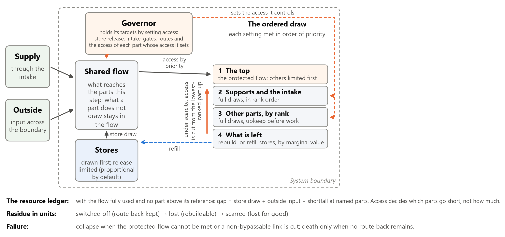
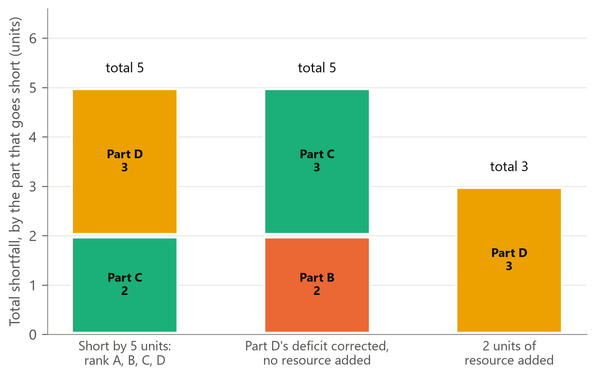
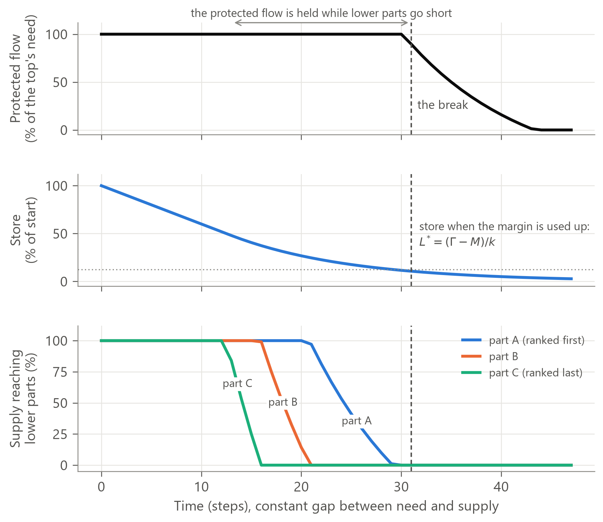
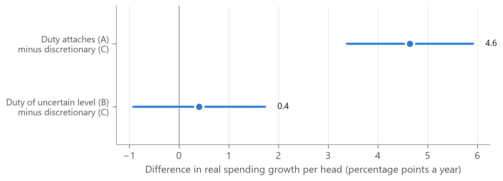

# From cells to councils: a conservation law of allocation under scarcity

*Version 2, in preparation (8 October 2026). Version 1 as last posted: public record v1.3 (https://doi.org/10.5281/zenodo.23241491); first posted: v1.2 (https://doi.org/10.5281/zenodo.23224208). Supplementary material: From cells to councils - supplement.md. Reference checks: Citation check.md.*

---

## Abstract

Under scarcity, allocation is zero-sum. Outside a few exceptions, named in advance, no ordering of access in a system short of a resource reduces its total shortfall: it only decides which parts go short, and correcting a deficit at one part leaves an equal deficit elsewhere. We state this as a conservation law, derived from a general model of how systems that must persist ration resources: all parts draw on one shared flow of each resource, each part's access is limited separately, and a governor protects the flow to one part, the top, by limiting everyone else's access first. Its ranked order of draws on a shared flow has been found separately in at least four fields, modelled or measured: organism energetics, human metabolism (the Selfish Brain), cell bioenergetics and plant carbon allocation. We found none carried beyond its domain. We reached it from principles about institutions and state the full architecture once, in seven components. From the general form follow results that none of the theories compared in Table 3 states formally across domains, including why a steady protected flow carries no information about the shortfall beneath it, the reserve at failure, when the speed of a decline causes lasting harm, and when rerouting overloads a route despite spare capacity. Of two pre-registered, blind-adjudicated tests, a predicted early warning before falls in arterial pressure in surgical cases with heavy blood loss failed, at half weight; this version finds errors in the prediction's derivation and in the test's mapping, and corrects both; whether they caused the failure is untested, and the verdict stands. The prediction that the order of loss follows access documented in advance was supported, at reduced weight, in English council spending, though not the version tied to deeper funding cuts. We state what would refute the model.

## 1. Introduction

Systems that persist under finite resources show a recurring pattern. When resources run short, the flow to the part that matters most is protected, while parts that matter less are run down out of sight. In a bleeding patient the protected flow is the oxygen the brain draws from its blood supply, measured against its resting need; in models calibrated to simulated and experimental blood loss, the vessels of gut and kidney narrow (Table 4), while arterial pressure, the figure clinicians watch, is held near normal as cardiac output falls (Evans et al. 2001). Under energy restriction the brain's own energy supply has priority (Peters et al. 2004), and brain mass, which observers can weigh, stays almost unchanged while body mass falls (Sprengell, Kubera and Peters 2021a). In English councils between 2014-15 and 2019-20, spending on lines with a statutory duty grew faster than on discretionary lines (Section 5.1), though the gap was not detectably wider where funding fell more. The balanced budget that observers watch is a level the council's rules hold. In a tree in drought the water-conducting tissue fails while canopy colour, which observers watch, lags the failure (Hammond et al. 2019); the tree's top, and so its protected flow, would be fixed by a mapping made in advance (Section 3.1). In the patient, the animal and the tree, the figure observers watch said little about what was happening beneath it until late. That is an observation of these cases. Proposition 2 concerns the protected flow, and whether a watched figure tracks it is a mapping question (Section 3.1).

**The law.** Under scarcity, allocation is zero-sum. At a fixed, fully used inflow, raising one part's access lowers another's, and while no part receives more than it requires, no setting of access reduces the total shortfall: it only decides which parts go short. The total falls only if resource is added, what parts require is lowered, a gate that holds resource back is opened, or what a part receives beyond what it requires is taken back. Every unit of the gap is met from a store, met from outside the boundary, or left unmet at a named part. Drawing a store meets the gap now and leaves less for later; drawing from outside meets it from beyond the boundary.

As algebra, this is an accounting identity (Proposition 1). Kleinrock's (1965) conservation law for queues is one too: in a work-conserving single-server queue, no non-preemptive priority discipline changes the load-weighted sum of waiting times across classes; it only moves delay between them. Kleinrock's order is a position in a queue; the model's order is priority set by access. In Kleinrock's law delay moves between classes; here nothing moves: the total shortfall is fixed, and access decides only which parts go short. The content of such a law is not its algebra. It lies in three places:
- **the reference:** each part's requirement is fixed in advance and never lowered because the part has shut down, so a shortfall cannot be defined away;
- **the exceptions:** they are named and can be checked;
- **practice:** how routinely it acts as if the law were false, by treating the visible figure.

**Four received views the law contradicts under scarcity.**
- **"Correcting an abnormal reading treats the problem."** In a resource-short system, correcting one part's shortfall outside the named exceptions only changes which parts go short (Proposition 1).
- **"A stable reading means a stable system."** The protected flow is held by drawing stores and outside input and by lower-ranked parts going short. While these cover the gap it carries no information about the shortfall beneath it, and it breaks only when they no longer can, which under proportional release leaves part of the store unused (Propositions 2 and 3). A reading the governor holds is kept steady by the same spending while its levers last; we state this in words only, not as a proposition.
- **"Resilience is a property a system has."** Under scarcity, resilience is a store being drawn, input from outside, or a lower-ranked part going without (Proposition 1).
- **"The failing organ is the problem."** Only sometimes, and the model says when. If parts outside the top and its supports are still supplied when the top or a support part fails, the supports were met in the step before, and no unit of the top or a support part is still coming back from an earlier shortfall, then with true signals the cause is a cut or narrowed supply line, or damage to the part (S1.9); a signal fault is the other candidate (S9.5). If lower-ranked parts have already gone short, the failure is the last visible step of a system-level allocation: look down the order (Proposition 4), and at where the shortfall began, which may be falling supply or rising requirement, including the part's own after damage (Section 3.4).

**What is new.** The same ranked order of draws on a shared flow has been found at least four times, modelled or measured. Organism energetics (Kooijman 2010), the Selfish Brain account of human metabolism (Peters et al. 2004), the hierarchy of ATP consumers in cells (Buttgereit and Brand 1995) and sink priority in plants (Minchin, Thorpe and Farrar 1993) each describe a ranked order of draws on a shared flow, with the lowest-ranked going short first. Each was built for one domain, and our searches found none carried into another. Where the order was measured (in cells), survived pre-registered review (the brain under caloric restriction) or emerged from mechanism in transport models rather than being assumed (in phloem), it is not a convenience of one model. We arrived at the same ranked order from a fifth direction, principles about conservation and priority in institutions, and state the full architecture once, as the Persistence Allocation Model. Three things none of them carries:
1. **an order of loss fixed in advance from documented properties of access** (pathway constriction, autoregulation, affinity, statutory status) **and the rules for requirement,** never read off the observed order;
2. **a conserved ledger of shortfall,** which counts unmet requirement against a fixed reference and records the part at which every unit of it goes unmet;
3. **application outside bodies.**

Of the results we derive from the general form, eight are stated formally across domains by none of the theories compared in Table 3.

**Tests.** We report two pre-registered held-out tests, each replicated and adjudicated blind. One failed, at half weight and with two qualifications; one gave partial support, in the model's first held-out test outside bodies (Section 5). This version finds errors in the prediction's derivation and in the test's mapping, and corrects both; whether they caused the failure is untested, and the verdict stands (Section 5.1).

**This paper:**
- Section 2: the four instances, and theories that state parts of the architecture elsewhere;
- Section 3: the model, in seven components, its reduced form, the aids used to map it, and four propositions, which assume the governor's signals are true (thirteen further results are in Supplement S1);
- Section 4: the predictions, and how they separate the model from its neighbours;
- Section 5: the tests;
- Section 6: scope, limits and failures;
- Section 7: what follows;
- Changes from version 1: every substantive change, and why.

## 2. Four instances of one ranked order

**Organism energetics.** Dynamic Energy Budget (DEB) theory is the instance for whole organisms (Kooijman 2010). It ranks the uses of reserve, paying somatic maintenance before growth and reproduction (the κ rule). It releases reserve in proportion to its content, shrinks structure when reserve cannot pay maintenance, and treats defence as "more facultative" than somatic maintenance. It conserves mass and energy. It ranks uses, not organs; it keeps no ledger of unmet requirement; and it allocates no repair, since damage in DEB is irreparable. We import three of its forms (Section 3). DEB's maintenance-first order holds within a part: what reaches a part covers its upkeep before its work. Across parts, rank comes first, because, where the governor sets a part's access, it sets it as a whole.

**The brain.** The Selfish Brain theory is the instance in human metabolism, with the brain as both the protected consumer and the regulator of the body's energy supply (Peters et al. 2004). The brain gives priority to its own supply by inhibiting glucose uptake into muscle and fat. In later formulations it suppresses insulin, closing the insulin-dependent route into muscle and fat while drawing through an insulin-independent one. This is set out as an energy-conserving supply-chain model (Peters and Langemann 2009), and a brain-centred compartment model has been analysed formally (Göbel and Langemann 2011). Peters, McEwen and Friston (2017) link it to the free energy principle: under uncertainty the brain demands extra energy from the body, and if it cannot reduce the uncertainty, a persistent cerebral energy crisis may develop that burdens the individual as allostatic load. The link between brain and body is stated in words. Its order has survived pre-registered systematic review: under caloric restriction the brain lost almost no mass while the body lost a great deal (Sprengell, Kubera and Peters 2021a). It is formal for two compartments and one resource. It has no order fixed in advance across many parts and no ledger.

**The cell.** In thymocytes the ranked order was measured. A hierarchy of ATP consumers loses supply in order: macromolecule synthesis first, ion pumping later, proton leak last (Buttgereit and Brand 1995). It is a measurement, without a general model. Here access is built into the parts, through their affinity for ATP, and is not set by a governor. Within a snapshot a built-in setting is fixed, as a governor's setting is, but a change in a part's requirement can move its place; rank under saturable uptake (S1.7) is the formal case.

**Plants.** In phloem transport the ranked order emerges from mechanism: "sink priority" follows from the transport network and the kinetics of the sinks (Minchin, Thorpe and Farrar 1993). Access is built into the network and the sinks and is not set by a governor; within a snapshot it is fixed, as a governor's setting is, but a change in a sink's requirement can move its place (S1.7). Hierarchical plant growth models instead assume strict priority among organs (Grossman and DeJong 1994; classified as hierarchical by Marcelis and Heuvelink 2007). The order is assumed in three places: hierarchical plant models; DEB, where maintenance priority is a postulate; and the Selfish Brain, where it is the theory's premise. It was measured in cells, emerges from mechanism in phloem, and has been tested in the brain.

**Parts of the architecture stated elsewhere.**
- The energetic model of allostatic load (Bobba-Alves, Juster and Picard 2022) proposes that the energetic cost of stress first uses up reserve capacity, then squeezes growth, maintenance and repair, potentially without raising total energy expenditure. That is the model's hidden shortfall, with growth, maintenance and repair squeezed, stated in words.
- Triage theory (Ames 2006) proposes that scarce micronutrients go to proteins needed for short-term survival over those needed for long-term health, partly through binding affinity, at the level of enzymes, cells and organs.
- A unifying theory of hypoxia tolerance (Hochachka et al. 1996) describes a balanced suppression of energy supply and demand: ion pumping and protein synthesis are cut back (channel and translational arrest) while the cell's energy state is held.
- Allostasis (Sterling 2012) treats regulation as predictive and brain-led.
- The central governor model of exercise (Noakes 2012) holds that exercise is stopped before any system fails, with a reserve of motor units always kept. It is contested: Shephard (2009) finds convincing experimental evidence for its corollaries lacking, and argues that a plateau in oxygen consumption at exhaustion counts against a limiting central governor.
- The selfish immune system (Straub 2014) adds the immune and repair system as a second claimant that can take control of the body's spare energy. In this model, the brain and immune regulators are two modes of one governor function. Straub's chronic case, the immune system as a standing claimant that changes the order, is the open question on modes (Section 6).
- Ashby (1952) defined adaptive behaviour as behaviour that keeps an organism's essential variables within physiological limits; when an essential variable moves far from its normal value, step-functions change the system's behaviour. It is an early form of the governor: targets on sensed levels, with no shared resource, store or ledger.
- Perceptual control theory (Powers 1973) describes hierarchies in which higher levels set the reference values of lower ones. It gives the governor its form, but has no resource, store or ledger.
- The free energy principle accounts for action, perception and learning as the minimising of surprise (Friston 2010). A heuristic proof, with simulations, suggests that any (ergodic) random dynamical system with a Markov blanket will appear to act on its world to preserve its integrity (Friston 2013). It supplies a partial form of the governor, a regulator of the system's own states, and the framing of persistence, with no shared resource, ranked access or ledger.

**What the convergence shows.** These fields developed in separate literatures; in what we read, none of the four cites another's allocation model. Their agreement is evidence that the ranked order is real. It is not evidence that the results derived from it here are true: those stand or fall by test (Sections 4 and 5).

Table 1 condenses the comparison; the full table, with twenty theories, is Supplement S3.

**Table 1. Prior theories against the model's features** (F, formal; W, stated in words; E, measured, without a general model; p, partial or different form; blank, not found in what we read; bold, no theory in the full comparison, Supplement S3, has it in formal form).

| Theory | Governor | Order from access | Order fixed in advance | Stores drawn first | Repair competes for access | Shortfall ledger | Outside bodies |
|---|---|---|---|---|---|---|---|
| Dynamic Energy Budget | p | p | | F | | p | |
| Selfish Brain | F | F (two compartments) | p | F | | p | |
| Allostatic load (energetic) | W | W | | W | W | W | |
| Triage theory | | W | p | W | W | W | |
| Plant hierarchical and transport-resistance models | | F | | p | | p | |
| Cell ATP hierarchy | | E/F (measured) | | | E | | |
| **This model** | F | F | **F** | F | F | **F** | **F** |

## 3. The model in formal terms

**In plain words.** All parts draw on one shared flow of each resource. Each part's access to that flow is limited separately, by a setting the part does not control (a part that sets its own access, such as a tumour, is a separate case; Section 7). The governor protects the top by limiting everyone else's access first. Nothing passes between parts; a shortfall is a count at a part, not something that moves. No work or shortfall is handed from one part to another. Resource moves only through the shared flow and its routes, and one part's state changes another's only through a dependency or through the physics of the network (S1.10). Access is either set by the governor or built into the part or route (as affinity is in cells, and transport and sink kinetics are in phloem), and both kinds of setting are fixed within a mode. A setting is the rule that gives a part's access at each sensed level, so a part's access can change within a mode while its setting does not. A built-in setting is not set by the governor: it fixes the part's access within its layer, and a change in the part's requirement can move its place in the order. The governor's regulation works through stores, intake, gates and the settings it does control; where it sets a part's access, a change in requirement changes that part's draw in its own turn, not its place. When a sensed level crosses its threshold and the governor acts, as in opening a damaged part's access where it sets that access, the setting is acting, not changing: access changes and the order does not. A mode change is a change in the order, or in which levels the governor holds, other than through built-in access; it ends the snapshot. The ordered draw of Section 3.3 is the arithmetic of those settings, not a queue: a part's place in the draw is its priority, not its location.

The general model, the Persistence Allocation Model, states the architecture as follows.

> In a system that regulates its own persistence, all parts draw on one shared flow of each resource, and each part's access to it is limited separately, by a setting the part does not control. A governor holds the levels the system's persistence depends on by acting through those settings; it protects the top by limiting everyone else's access first. Parts have no demand of their own. Each part works to the limit of the scarcest resource it can draw. When what a part draws falls short of what the reference state requires, whether supply falls, requirement rises or access is restricted, a shortfall is counted at that part. Where the system as a whole is short, the governor draws its stores and turns down the access of lower-ranked parts first, and they switch units off. The protected flow holds until nothing more can be taken: it shows compromise, not stress. At a fixed, fully used inflow, raising one part's access lowers another's: the resource gap is met from stores, met from outside the boundary, or left unmet at a named part, and a shortfall leaves its residue in switched-off, lost or scarred units, or in work not done. A part scales down without harm when its supply falls no faster than it can switch units off and its upkeep is still met; units are lost when supply falls faster, or below its upkeep; the part is scarred, with those units lost for good, only when the losses destroy what rebuilds it or its route back is cut. Repair is work like any other: damage raises the damaged part's requirement, which is met, like any requirement, within the part's rank. Recovery runs the other way: after the top, the support parts' draws, the intake's among them, are served before every other part's; switched-off and lost units, and stores, come back by marginal value (S1.12). The system collapses when the protected flow can no longer be met or a non-bypassable link is cut, and dies only when no route back remains.

**Two chains are real.** Nothing passes between parts, but two links tie one part's state to another's:
- **dependency:** the top relies on support parts' work, so a support part's shortfall lowers delivery to the top one step later (Proposition 2): the dependency lag, counted at the top;
- **network physics:** where flow divides by physics, losing or narrowing a route raises the flow on the others (S1.10).

Cascades of work between peers are a dependency of requirement. A part whose requirement rises when another part's work falls depends on that part's work: its shortfall is counted under rising requirement, with the link documented at mapping, before outcomes, under the same guard as modes and gates (S9.2). Nothing passes between parts; the requirement link is a dependency. Most of what is called a cascade of work sits inside one part: staff are units of a team, a vacancy is a lost unit, and the team's requirement is unchanged.

### 3.1 Seven components

The model has seven components, and only these are called components. Everything else in this section is a mapping aid (Section 3.4).
1. **Boundary.** Fixed first. It decides everything else, including which part is the top.
2. **Governor.** A set of targets on sensed levels. If a sensed level crosses its threshold, the governor acts until it returns. It owns the signals and does no work. Its sensing and signalling are carried out by parts, which pay their cost. It is a function, not a place. The results assume its signals are true, in sensing and in command (Section 3.3).
3. **Parts.** Anything that does work. Parts have no demand of their own. Each part has a rank, fixed in two steps: its dependency layer, then its order within the layer (Section 3.3). One part is the top: the part everything else is sacrificed to keep going.
4. **Protected flow.** The flow of the resource to the top, which has to be maintained, and is being maintained, at all costs, measured against the top's need.
5. **Network.** The routes the resource moves along.
6. **Stores.** They hold resource and release it.
7. **Outside input.** Resource or energy drawn from across the boundary.

**Classification rules.**
- Anything that does work is a part, including work done on the governor's signal. The signal belongs to the governor and the work to the part: vessel-wall muscle narrowing a route is a part's work. Parts pay the cost of signalling.
- Repair is work like any other (Section 3.4). The intake is a part.
- Components are roles, not objects. One structure can play two roles: a vein is a route, and the blood in it is a store.
- What a part is made of are its units (cells in an organ, staff in a department), not parts.
- Where the governor sets a part's access, it sets it as a whole. It does not split a part's draw between upkeep and work: what reaches a part covers its upkeep first, then its work.
- The model describes an arrangement, not an intention: nothing in it decides, wants or chooses.

**Protected flow and indicators.** An indicator is whatever an observer watches. It may be the protected flow, a level the governor holds, or neither; a mapping says which and never assumes it. Proposition 2 concerns the protected flow only, and says nothing about indicators in general. Where an indicator is a level the governor holds, the governor's action holds it while its levers last. *Terminology:* in the author's earlier institutional framework, "record" meant what institutions measure; that corresponds to an indicator here.

### 3.2 Architecture

Time runs in steps. In each step three functions apply:

$$g(t)=G\big(\text{sensed state}(t),\ \text{environment}(t)\big),$$

$$a_{ir}(t)=\Phi_{ir}\big(\{U_r,\ I_r,\ \text{stores}\},\ \text{network},\ g(t),\ \sigma_i(t)\big),$$

$$\sigma_i(t+1)=F_i\big(\sigma_i(t),\ \{a_{ir}(t)\}_r\big).$$

- **The governor** $G$ holds its targets by setting access, $g$: store release, intake, the capacity of routes and gates, and the access of each part whose access it sets, including a damaged part's. It protects the top by limiting everyone else's access first. It does not set allocations, and it does not switch units off.
- **The network** $\Phi$ is the routes. Given the access settings and the parts' work, it gives the realised flow $a_{ir}$ of resource $r$ to part $i$. In bodies the routes are vessels and channels; in organisations, budget lines. Work that moves resource along a route is a part's work: a heart pumping, a transporter that spends energy (the receiving part's work), the finance function moving money. A drive that no part makes, such as evaporation driven by the sun, is outside input.
- **A part** $F_i$ changes state only through what it draws, except by outside damage. It has no utility or claim. Parts have no demand of their own: what a part requires is set by a rule fixed in advance (its reference), which rises only as that rule provides: under a load applied to the system, with damage, or through a documented requirement link, never because the part asks. The governor sets access, never requirement. Damage from outside removes units or route capacity and raises the damaged part's requirement. Units lost to a shortfall are not damage.

A part consists of $K_i$ units, each **active**, **switched off** (its route back kept, basal maintenance only, little or no work), **lost** (rebuildable) or **scarred** (lost for good: the losses destroyed what rebuilds it, or its route back is cut). One part, the **top**, receives the protected flow.

### 3.3 The reduced form

Where the network is not modelled explicitly, the flow is written as an ordered draw (Figure 1). For resource $r$ the available flow in a step is $S_r=U_r+I_r+\sum_sd_s$: supply through the intake, resource drawn in across the boundary, and store draws. Parts draw from it in a fixed **order** $\pi_r$, each up to its full draw:
1. the top's full need;
2. support parts' full draws, in rank order (parts the top depends on, and the intake);
3. every other part's full draw, in rank order;
4. what is left: reactivation and rebuilding against refilling the stores, by marginal value.

Each part is drawn in full in its turn, and what reaches a part covers its upkeep (basal maintenance) first, then its work and renewal. So a part that is short loses work before upkeep, and the lowest-ranked part is cut fully before the next is touched. What a part does not draw stays in the flow; nothing is returned. The ordered draw is the arithmetic of the access settings, not a queue: a part's place in the draw is its priority, not its location. A requirement raised by damage is met within the damaged part's rank, because the governor, where it sets the part's access, opens that access in response to local signals of the damage. Units lost to a shortfall are not damage, and rebuilding them is not repair. They are rebuilt from what is left: rebuilding them is not part of the part's draw, so it competes for the surplus by marginal value as supply returns (S1.12).

**Figure 1. The model's architecture in the reduced form.** The governor sets access (store release, intake, gates, route capacity and the access of each part whose access it sets), not allocations. The flow available in a step (supply through the intake, outside input and store draws) is drawn by parts in a fixed order of priority: the top's full need; support parts and the intake, in full; every other part in full, by rank, with upkeep before work inside each part; and what is left, which goes by marginal value to rebuilding or to refilling stores. Under scarcity, access is cut from the lowest-ranked part upward. The footer gives the resource ledger in the scarcity-limited regime (Proposition 1), the residue a shortfall leaves in units, and the failure conditions (S1.9 and S1.11).

**Rank.** Rank is fixed in two steps. The first is the dependency layer, from the top down: the top, then the parts whose work feeds the top, then the parts that feed those. The second is the order within a layer, which comes from documented access and, where access is built in, from requirement. $\pi_r$ is the order of priority for $r$; parts lose adequate access to $r$, when $r$ alone is scarce, in the reverse order. **It is fixed in advance from documented properties of access** and, where access is built in, from the rules for requirement, and is never read off an observed order of loss. The reduced form keeps one support layer. Deeper dependency layers extend the order; the propositions are not claimed for that case.

**Modes and snapshots.** The top never changes within a boundary. Below it, the order follows from access and requirement. Access settings are fixed within a governor mode and change only when the mode changes. When a sensed level crosses its threshold and the governor acts, the setting is acting, not changing: access changes and the order does not. A mode change is a change in the order, or in which levels the governor holds, other than through built-in access; modes are documented independently, before outcomes are seen (S9.2). The model applies to one mode at a time, a snapshot. A threshold switch, such as decompensation in blood loss, is a mode change: crossing its threshold changes the order, or which levels the governor holds, and ends the snapshot.

**Assumptions for the results:**
- results hold resource by resource;
- the ordered draw above, with a fixed order, while no requirement changes the order;
- the store release forms in Section 3.4;
- a reference fixed in advance;
- units changing only through supply, except by outside damage;
- the governor's signals are true (sensing and command): what it senses matches the real levels, and the access it sets is put into effect; the realised flow may still be limited by the network (S1.9).

### 3.4 Mapping aids

Everything in this subsection is a mapping aid, not a component.

**Work, stores and units.**
- **Work** is limited by the scarcest resource, $w_i=\min\big(\hat c_i,(1-\epsilon_i)w^0_i,\min_rA^w_{ir}/\kappa^w_{ir}\big)$, with $\hat c_i$ effective capacity and $w^0_i$ reference work. The synthesising-unit form (Kooijman 2010) is the smooth general case.
- **Renewal** needs a baseline per active unit plus wear per unit of work, $\kappa^nn^{\text{a}}+\kappa^uw$.
- **Stores** release up to a limit in proportion to content by default, $\rho_s=k_sL_s$ per step (DEB), or at a constant rate until empty (full release). A fraction of undrawn flow refills them; the rest is spilled.
- **Units change only through supply, except by outside damage.** Unpaid basal maintenance is paid from the part's own units, so the part shrinks (DEB). Unmet renewal switches units off at up to $\theta K$ per step, and the rest fail at rate $1/\tau_f$. Losses in one episode beyond a template limit $Q^\ast K$ are scarred, as are units whose route back is cut.
- **Units take their part's access.** Which units within a part go first (for example, by distance from the supply) is a mapping aid. Work is counted once, at the part.
- **Repair** is work like any other, of two kinds. **Routine repair**, renewing worn units, is part of each part's own draw (the renewal terms $\kappa^n$ and $\kappa^u$), so it falls when that part's access falls. **Damage** raises the damaged part's requirement (rising requirement). The governor meets it as it meets any requirement, by opening that part's access where it sets that access, and by releasing stores into the flow, within the part's rank; local signals that open a damaged part's access belong to the governor. The part's response to what arrives is a consequence. Under saturable uptake, raised requirement also raises the part's adequacy threshold (S1.7), so damage can move the part's place in the order. Where the governor sets access, a raised requirement enlarges the part's draw in its own turn and does not move its rank. Repair cells working at a damaged part are counted at that part, as its units. A part whose work produces a resource that repair needs (for example, bone marrow) adds that resource to the flow, like the intake. Units lost to a shortfall are not damage, and rebuilding them is not repair: it is paid from what is left once every part has drawn (Section 3.3). No rule puts repair first or last.

**The top's own routes.** The top's own routes can narrow: in simulated blood loss the brain's estimated vascular resistance rose as blood velocity in its middle cerebral artery, a proxy for its blood flow, fell (Bondar et al. 1995; S7.3). The reduced form simplifies this away.

**Shortfall and the two ledgers.** For each part and resource, the **reference allocation** $q^0_{ir}$ is fixed in advance as a rule and never lowered because units have switched off. **Shortfall** is its unmet part, $\ell_{ir}=[q^0_{ir}-a_{ir}]_+$. It has three origins: falling supply, rising requirement, or a governor mode that restricts access while resources suffice. The last is admitted only for a mode and gate documented independently in advance. Rising requirement includes requirement that rises when another part's work falls, admitted only for a requirement link documented in advance. Requirement raised by damage follows a rule fixed in advance with the reference allocation, and counts only for damage documented independently.

**The resource ledger.** With the gap $\Gamma_r=\sum_iq^0_{ir}-U_r$, in the scarcity-limited regime, where the flow is fully used and no part receives above its reference, every unit of the gap is met from a store, met from outside, or left unmet at a named part (Proposition 1). In general, resource left unused and allocation above reference enter as well.

**The state ledger.** It records what a shortfall leaves behind: units switched off, lost or scarred, and work not done. Work not done that falls on another system, across the boundary, is outside this ledger and belongs to that system's mapping. Residue is a consequence of shortfall and is never added to the resource ledger.

**The margin** $M$ is what can go unmet below the top before the protected flow moves: the other parts' full draws $D$ where delivery to the top depends on support parts' work, and $P+D$ where it does not, with $P$ the support parts' full draws. $N$ is the top's full need, and $\sum_iq^0_i=N+P+D$.

**The other mapping aids** are rank detail (S9.3), modes and gates (S9.2), economising, a governor mode (S1.4), templates and scars (S1.8), and viability and the capture basin (S1.11). Economising lowers access, not the reference; what goes unmet is still counted as shortfall.

### 3.5 Propositions

Proofs are in Appendix A. **Every quantitative statement in the main text, and every result in S1 except S1.5, S1.6 and S1.11, was checked numerically** against an independent implementation of the reduced form (Supplement S2). Two of the checks corrected earlier statements of the same results, and review corrected four more, and the final check of version 2 two more (S2, items 8 and 9); version 2 also changed the order of the draw, and its results were re-derived and rechecked.

**Thirteen further results are in Supplement S1.** Seven were Propositions 5 to 11 in version 1 and moved there in version 2. Their checks are unchanged, and S1.9 gains two; S1.9 and S1.13 are restated, and the proofs of S1.11 and S1.12 adjusted, for the version 2 order, and S1.8, S1.11 and S1.13 are reworded for repair as work like any other (Changes from version 1, items 9 and 11):
- rank under saturable uptake (S1.7);
- rate decides harm (S1.8);
- exhaustion, severance and constriction (S1.9);
- rerouting (S1.10);
- collapse, not death (S1.11);
- recovery order and partial refill (S1.12);
- repair under strict rank (S1.13).

The other six are a lead time (S1.1; it was G12's derivation, and is read in version 2 as the length of the G27 window), the limit under conflicting orders, shrinking, economising, the fuse, and rising requirement (S1.1 to S1.6).

**Conservation**

**Proposition 1 (conservation under scarcity, creation by gating).** In any step, $\sum_i\ell_i=\Gamma-\sum_sd_s-I+R_{\text{unused}}+X$, where $R_{\text{unused}}$ is resource left unused (refilled, spilled or left in the flow) and $X$ is allocation above reference.
1. **Scarcity-limited regime.** Where the flow is fully used and no part receives above its reference, total shortfall is the same under every setting of access at fixed supply, store draw and outside input. Access decides only which parts go short.
2. **Access-limited regime.** Where a gate leaves resource unused, total shortfall rises one for one with the resource left unused, balanced by refill or spill. Opening the gate by the resource it leaves unused removes that shortfall without any other part losing; opening it further is a change of access in the scarcity-limited regime.

The identity is elementary. Its content is the reference fixed in advance and never lowered, and the named exceptions: resource added, requirement lowered, a gate opened, or allocation beyond requirement taken back (Section 1). In a resource-short system, restoring one part's supply outside the named exceptions leaves an equal deficit elsewhere (Figure 2). In an access-limited system, where a gate holds a process shut while resource is available, opening the gate by the resource left unused relieves the process with no deficit elsewhere. The two regimes predict different consequences of the same intervention.

**Figure 2. Proposition 1 in the scarcity-limited regime, a worked example.** Four parts, A to D, each need 3 units, and supply is 7, so the system is 5 units short. Left: with rank A, B, C, D, parts C (2 units) and D (3) go short. Centre: part D's deficit is corrected by moving it to the front of the order, with no resource added; B and C go short instead, and the total stays at 5. Right: adding 2 units of resource, one of the named exceptions, lowers the total to 3.

**The silence and the break**

**Proposition 2 (silence).** In a step in which no unit of the top or a support part is still coming back from an earlier shortfall: without a delivery dependency, the protected flow is met if and only if $S\ge N$; where delivery to the top depends on support parts' work, the same holds if the support parts were met in the step before, and the support parts are met if and only if $S\ge N+P$. Hence, with the gap and supply the same from step to step, the protected flow holds if and only if $\Gamma\le\sum_sd_s+I+M$, with $M=P+D$ without that dependency and $M=D$ with it.

Where the support parts were not met in the step before, the top can be short while every other part draws in full: that is the dependency lag. It is counted at the top, not a break in the order, and the earlier shortfall must be observed, not inferred from the later one (worked example in S1.9).

Where units of the top or a support part, switched off or lost in an earlier shortfall, are still coming back, the top can be short while every other part draws in full: that is the recovery lag. It is not a break in the order, and the earlier shortfall must be observed, not inferred from the later one (worked example in S2).

Inside that region the protected flow carries no information about shortfall below the top (Figure 3). Outside input extends the silence exactly as a store does. It breaks at two thresholds: at once, and one step later through dependency.

**Proposition 3 (store left at the break).** A constant gap $\Gamma$ per step is met from one store from level $L_0$, with no outside input, and $M<\Gamma\le kL_0$. Under full release at a rate of at least $\Gamma$, the protected flow breaks when less than one step's gap is left in the store, whatever $\Gamma$ (one step later with a delivery dependency). Under proportional release the margin is used up when the store falls to $L^\ast=(\Gamma-M)/k$: **a larger gap per step leaves more of the store unused,** linearly, with slope $1/k$. The protected flow breaks in that step without a delivery dependency, and one step later with one (Proposition 2).

The intuitive rate-independence of the break holds only for full release. Under the default release, the reserve remaining at the break should rise with the rate of loss.

**Figure 3. The silence and the break (Propositions 2 to 4), simulated in the reduced form.** A constant gap of 12 units a step (need 22: the top 10, one support part 3 (upkeep 1, work 2) and three other parts at 3 each (upkeep 1, work 2); supply 10) is met from one store with proportional release ($k=0.08$). Delivery to the top in a step is in proportion to the support part's work in the step before, so $M$ is the other parts' full draws, 9 units. Bottom: the other parts are cut in turn, C fully before B and B fully before A (Proposition 4). Top: the protected flow stays flat while all three go short (Proposition 2). Middle: the protected flow breaks one step after the store falls to $L^\ast=(\Gamma-M)/k$ (through the dependency), an eighth of its starting level (Proposition 3). Parameter values are illustrative.

**The order of loss**

**Proposition 4 (order).** In a step in which the support parts were met in the step before and no unit of the top or a support part is still coming back from an earlier shortfall, parts short of their draw form a lower segment of the rank order, and a part that is short loses work before upkeep. No part goes short while a lower-ranked part draws anything. Support parts go short only after every other part has nothing, and the top goes short last.

In such a step at most one part is partly supplied. Where the support parts were not met in the step before, the top can be short while every other part draws in full: the dependency lag (Proposition 2), counted at the top, not a break in the order. Where units of the top or a support part are still coming back from an earlier shortfall, the same can happen: the recovery lag (Proposition 2).

Strict priority of this kind is an assumption in hierarchical plant models (Grossman and DeJong 1994; Marcelis and Heuvelink 2007). Here it is the reduced form of access settings, with the order fixed in advance. It is the limit case, not the general claim. What the four fields share is a ranked order of draws: under saturable uptake parts go short together when their thresholds are close (S1.7), and in councils a coarse measure points against strict cutting (S5.2). Whether a system's priority is strict or graded is itself a test.

## 4. Predictions, and how they separate the model from its neighbours

The model's predictions fall into two layers. **Layer 1** is what any feedback loop that holds a flow by drawing a finite store would be expected to show: the protected flow is flat while a store is drawn (G1), the break comes at a set depletion, and a larger store gives a longer silence. Confirming layer 1 says little about the model. **Layer 2** needs selection or design: the order of loss, switches, the order of recovery, repair competition. Table 2 lists the predictions that follow from Propositions 1 to 4 alone, every prediction that has been tested, and G27, which replaces the tested G12 (its window uses S1.1). Predictions that also need a supplementary result (G5, G13 and G20 among them) are in Supplement S4, with the full list and status.

**Table 2. Main predictions.**

| No. | Prediction | Derived from | Status |
|---|---|---|---|
| G1 | The protected flow stays at the top's need while lower parts and stores move | Prop. 2 | Natural observations of held indicators do not test G1. The one observation of the protected flow (by a proxy, S7.3) fell before the break and is logged against the model. H1 check (on an indicator) not consistent (low weight) |
| G2 | Lower-ranked parts lose access first, in ascending rank | Prop. 4 | Compatible: calibrated haemodynamic models (Table 4). Krieger (1921) logged against, not yet weighed (Section 6) |
| G3 | With a store meeting the gap and its release not binding, the break comes at the same cumulative gap whatever the rate to within one step's gap (Proposition 3); with a delivery dependency, the cumulative gap at the break is larger by one step's gap, so it rises slightly with the rate. Where release binds (a tapering store, or a gap above the release rate), faster onset breaks earlier. Under proportional release, the margin is used up when the store left is (gap minus margin) divided by the store's turnover rate, so a larger gap per step leaves more of the store unused, rising linearly with the gap; the break comes then, or one step later where delivery to the top depends on the support parts | Prop. 3 | Not yet tested. Indicator-defined events (a 30 mmHg fall in pressure in sheep; tree death) fit the first clause; no break of the protected flow was observed (Table 4) |
| G4 | A larger store gives a longer silence; a depleted start breaks sooner | Prop. 2 | Not yet tested. Natural observations of indicator-defined events fit (S6); they do not test the protected flow. Logged against, not yet weighed: Hikino et al. (2026; Section 6; S7.2) |
| G12 | Recovery from small knocks slows before the break where release headroom shrinks | Supplement S1.1 | **Failed its first held-out test,** at half weight, with two qualifications: runnable only under the pre-data reading of missing bins, and the step-down inside the fallback cohort not stated in the pre-registration (Section 5.1). Its derivation was in error; G27 replaces it |
| G25 | The order of loss is predicted by properties of access documented beforehand | Prop. 4; S1.7 | **Supported in its first held-out test,** at half weight (Section 5.1) |
| G25-C | The protection gap between lines with and without a duty widens where funding fell more (the scarcity version of G25) | Prop. 4 | **Not supported** in its first held-out test, at half weight (Section 5.1) |
| G27 | As the break approaches, fluctuations in the gap show first in the store's release while it has headroom, then in the access of the lowest-ranked part still supplied, then in each part above it in turn, and in the protected flow only at the break | Props. 2, 4; S1.1 | Not yet tested. Added in version 2 (Section 5.1) |

**What the model predicts that neighbouring theories do not state.** Table 3 lists results that follow in the model but are not stated in the neighbouring theories as we have read them. Some appear in words (in allostasis especially), and rerouting by physics is known in power engineering, where contingency analysis computes how flow shifts onto the surviving lines after an outage (Wood, Wollenberg and Sheblé 2014); none is stated formally across domains. Silence is not contradiction: the entries mark where the model makes a claim those theories do not make, and where a test can tell them apart.

**Table 3. Results not stated formally across domains in neighbouring theories.**

| Result | DEB | Selfish Brain | Allostasis and allostatic load | Control theory |
|---|---|---|---|---|
| Under scarcity, access decides only which parts go short; gating creates and removes shortfall (Prop. 1) | Conserves mass and energy; no ledger of unmet requirement | Build-ups in front of bottlenecks; no ledger across many parts | Hidden shortfall, in words | No resource ledger |
| The protected flow carries no information inside the silence region (Prop. 2) | Not stated | Brain held while body loses, two compartments | Stated in words | Not stated as a shortfall budget |
| Store left at the break rises with the gap per step (Prop. 3) | Gives the release form; not the break | Not stated | Not stated | Not stated |
| Rank under saturable uptake from affinity, capacity and requirement (S1.7) | Not stated across parts | Access by insulin dependence, two compartments | Not stated | Not stated |
| Scar threshold in speed and depth (S1.8) | Shrinking under unpaid maintenance; no switch-off rate, unit states or scar rule; damage irreparable | Not stated | Wear, in words | Not stated |
| Failure of the top while parts outside it and its supports draw implies a cut or narrowed link, damage, a dependency lag or a recovery lag (S1.9) | Not stated | Not stated | Not stated | Not stated |
| Rerouting by physics against rerouting by settings (S1.10) | Not stated | Not stated | Not stated | Known in power-systems engineering (Wood, Wollenberg and Sheblé 2014); not stated across domains |
| Repair served strictly by rank (S1.13) | No repair allocation | Not stated | Repair squeezed, in words | Not stated |

The sharpest discriminating tests are these:
- **Conservation:** in a resource-short system, a correction at one part that adds no resource (from outside or from a store), lowers no part's requirement, opens no gate and takes back no allocation beyond a part's requirement should leave a matching deficit elsewhere.
- **The order of loss from access** (G25) in systems the model was not built on.
- **The scar threshold:** with the route back intact, a scar needs speed and depth together (S1.8).
- **Strict-rank repair** (G23(b); S1.13).

## 5. Tests so far

### 5.1 Held-out tests

Both tests were pre-registered before any outcome data were opened. Each computation was replicated by a second AI system (ChatGPT, OpenAI): it wrote its own analysis script from the pre-registration and our code, without seeing the data or the results, and the script was run on the same files. Each verdict was then given blind against fixed adjudication rules by the same system, in a separate session with no shared context. Records are in Supplement S5.

**H1: warning before falls in arterial pressure in surgical cases with heavy blood loss (G12).**
- **Data:** VitalDB, an open database of high-resolution intraoperative recordings (Lee et al. 2022).
- **Prediction:** before falls in arterial pressure in cases with high blood loss, recovery from small fluctuations should slow. This was measured as a rise in the lag-1 autocorrelation of mean arterial pressure, against controls from the same case.
- **Cohorts:** the primary cohort (no vasopressor boluses) had, at 20% of estimated blood volume, 0 high-loss and 16 low-loss qualifying cases, both short of the 20 required, so it was not runnable. The fallback cohort, with a loss threshold of 15% of estimated blood volume, gave 25 high-loss and 42 low-loss cases.
- **Result:** the median excess rise was −0.072 (one-sided p = 0.48), and high-loss cases did not exceed low-loss ones (p = 0.78). **G12 failed,** at half weight, with two qualifications:
  - the test is runnable only under the pre-data reading of missing 10-second bins;
  - the step-down of the loss threshold inside the fallback cohort was fixed in code before the data were opened, but not stated in the pre-registration.
- **G1 check (low weight):** pressure stayed within 20% of baseline while haemoglobin fell in 10.7% of 75 cases, against a pre-stated "more than half". Not consistent.
- **Reading under the model's standing rule:** the first candidate for revision was the mapping, not a new mechanism. Version 2 names the faults, below. The verdict stands; G12 as stated is replaced by G27.

**H1 corrected in version 2 (the verdicts stand).**
- **The derivation.** G12's derivation (S1.1) put the warning in the protected flow, which Proposition 2 says is silent before the break: once the store's headroom is used up, a fluctuation is met within the margin $M$, below the top, and shows in the protected flow only at the break, which comes when the margin is also used up, or one step later where delivery to the top depends on the support parts, as in this mapping. H1 tested G12 as stated, and G12 as stated failed.
- **The mapping.** The corrected mapping redraws the frozen boundary (the patient's circulation plus the anaesthetist) to the patient, with the anaesthetist as an outside loop. At this whole-body boundary the top is the brain, and the protected flow is the oxygen the brain draws from its blood supply, measured against its resting need. Mean arterial pressure is an indicator. It tracks a level the governor holds: the stretch of the arterial wall at the carotid sinus and aortic arch, sensed by the baroreceptors (the arterial baroreflex; Chapleau, Hajduczok and Abboud 1991). H1 measured an indicator, not the protected flow. This correction was made after the result: it is post hoc and is not a test (Section 6).
- **The release profile.** The frozen H1 map committed a store that tapers as it empties, possibly ending in a switch. The pre-registration named the release profile as the first candidate for revision if G12 failed, and it is logged as that. Which release profile held in the VitalDB cases is untested. The pre-registration bars explaining the null as a switch. It is not explained, and the verdict stands. A later test under anaesthesia must fix its release profile from evidence under anaesthesia: in Evans et al. (2001), anaesthetic agents blunted or abolished the compensation (for example, halothane) or the switch (for example, alfentanil).
- **G27,** defined and untested: as the break approaches, fluctuations in the gap show first in the store's release while it has headroom, then in the access of the lowest-ranked part still supplied, then in each part above it in turn, and in the protected flow only at the break. A test of G27 needs a system whose final store tapers.
- **G18 in H1.** The exploratory measure G18, pre-specified on 6 October under the original framing, paired heart rate and stroke volume with mean arterial pressure. Before falls, the correlation of pressure with heart rate became more positive (median excess change +0.126, 25 cases; window medians 0.16 to 0.33, at control times 0.20 to 0.12, from the post hoc follow-up in S5.1); with stroke volume it did not change (median excess change −0.0018, 12 cases). Heart rate moved with pressure, not against it. G18 as mapped paired two outputs of one part (the heart) with an indicator, not two parts, so it was not a test of G18 as stated, and it is not evidence for G27. It was not scored and is not counted.
- **The corrected mapping** is in a new file beside the frozen setting map, which remains the test record (S5.1).

**PT1: order of loss from documented access in English local government (G25).**
- **Data:** single-tier councils in England, 2014-15 to 2019-20: 121 councils and 93 spending lines.
- **Access property:** each line was classified **blind**, before any spending data were opened, by whether a statutory duty attaches to it: class A, a duty; class B, a duty of uncertain level; class C, discretionary.
- **Primary question (fixed against dynamic priority): inconclusive** at full weight. Projected client growth published before each budget showed no detectable effect on which lines were protected (β = 0.05; 95% interval −0.75 to 0.86), but the interval includes the smallest effect set in advance as meaningful (0.25).
- **G25: supported, at half weight** (the broad pattern was known in advance). Within a council and year, real spending per head on class A lines grew about 4.6 percentage points a year faster than on class C lines (one-sided p = 2×10⁻¹¹; Figure 4). Class B was not distinguishable from class C, and that step fails its ordering when London is excluded. The measure is spending, the allocation each line received under its access. The frozen map set each line's reference as its base-year real spending per head; its requirement in version 2's terms, and so its shortfall in those terms, was not measured.
- **G25-C: not supported, at half weight.** The scarcity version, that the gap widens where funding fell more, was not supported: the interaction was 0.22 (SE 0.25).

This is the model's first held-out test outside bodies, and its first held-out support, for order of loss only, and for statutory over discretionary lines (A over C); the coarse, unscored measure in S5.2 points against strict-rank cutting.

**Figure 4. PT1: order of loss in English single-tier councils, 2014-15 to 2019-20 (G25; 121 councils).** Difference in the growth of real spending per head between classes of spending line, within a council and year: duty (A) minus discretionary (C), 4.6 percentage points a year (one-sided p = 2×10⁻¹¹); duty of uncertain level (B) minus discretionary (C), 0.4 (p = 0.27). Bars are approximate 95% intervals, recovered from the one-sided p-values with the analysis's t distribution (120 degrees of freedom), because the G25 results record p-values, not standard errors. The scarcity version (G25-C), not supported, is not shown.

### 5.2 Natural-system observations

Before the held-out tests, the model was checked against published findings in several natural systems, with predictions written down before the sources were opened. These checks are **not tests**: some outcomes were known in advance, sources were often read through summaries, and three early refinements of the model were built from blood-loss and fasting findings (Section 6). We report them as compatible observations (Table 4; full records in Supplement S6). One observation of the protected flow itself is logged against the model.

**Table 4. Natural-system observations.**

| Feature | Blood loss | Plants in drought |
|---|---|---|
| Indicator steady while blood loss or drought deepens | Arterial pressure, an indicator that tracks a level the governor holds (arterial wall stretch, sensed by the baroreceptors; Section 5.1), well maintained while cardiac output falls (Evans et al. 2001); vital signs stable in early bleeding while the compensatory reserve falls (Convertino et al. 2016) | Canopy colour, an indicator not mapped here (not a flow, so not the protected flow), lags hydraulic failure, best predicting trees already dead rather than dying (loblolly pine saplings; Hammond et al. 2019) |
| Protected flow held | **Against the model:** blood velocity in the middle cerebral artery, a proxy, fell by 27% at presyncope while arterial pressure was 2% above baseline (9 volunteers, lower-body negative pressure; Bondar et al. 1995; S7.3) | Not observed |
| Lower priority pays first | Splanchnic vasoconstriction the dominant compensation in a model calibrated to 35 adults under lower-body negative pressure (Bergauer et al. 2026); renal resistance rising before carotid in a model calibrated to 43 swine (Sadid et al. 2026, preprint) | Not used here: the leaves-first ordering is contested (Section 6) |
| Same depletion at an indicator-defined event whatever the rate | Blood volume removed at a 30 mmHg fall in mean pressure: 27.0 ± 4.2% at about 0.4% of blood volume a minute against 27.3 ± 3.2% at about 2% a minute (mean ± SE; 8 sheep, crossover; Scully et al. 2016) | Saplings died at the same loss of conductivity under fast and slow drought, with species-specific thresholds (about 95% and 45%; Dai, Wang and Wan 2018) |
| Switch or death at a set depletion | Decompensation (sympathetic withdrawal) once cardiac output falls to 50 to 60% of rest, about 30% blood loss (Evans et al. 2001) | About 80% loss of conductivity in loblolly pine saplings (Hammond et al. 2019) |

The sheep result fits full release, or a store with turnover high relative to the gap, if the fall in arterial pressure marks the protected flow's break, which was not observed (Proposition 3). It is an observation about the release profile in that setting, not a test.

## 6. Scope, limits and failures

**Scope.**
- **Persistence is a viability constraint, not something maximised.** The governor keeps the system within the states compatible with its continued existence; within that envelope, the model says nothing about what the parts' work is for.
- **Terminal reproductive programmes are out of scope** (semelparous salmon, some marsupial males, monocarpic plants). There, individual persistence stops being the protected constraint. The model should work before the reproductive switch and fail after it.
- **The model is not a theory of action selection.**
- **The boundary, the top, the protected flow and the classification of components are fixed before outcomes** and are not redrawn after a counterexample. A mapping fault named after a result is corrected in a new file beside the frozen one, as post hoc, and is not a test. H1's corrected mapping, which redraws the frozen boundary (the patient's circulation plus the anaesthetist) to the patient, is such a correction, and the verdict stands (Section 5.1).
- **Systems with signal faults are outside the propositions.** The propositions assume the governor's signals are true (Section 3.3). For a system whose governor senses false levels, or whose settings are not carried out, the model is diagnostic only (Supplement S9.5).

**Limits of the formal results.**
- The propositions hold for the reduced form, not for a general network. Where several complementary resources bind together and their orders conflict, ordinal ranks do not decide the outcome (Supplement S1.2): the network must be mapped explicitly.
- **The model takes access settings as fixed within a governor mode, changing only when the mode changes, with the order below the top following from access and requirement (Section 3.3). Whether access settings change when the mode changes, and only then, is an open empirical question.** Under built-in access, a requirement that rises by its rule can move a part within its layer; the move is computed in advance (S1.7). PT1's primary question asked whether, within one setting, the order is fixed or follows projected need; its verdict was inconclusive (Section 5.1), and it is unchanged. A valid test needs two recipients competing for the same scarce resource at the same time, with the governor's mode documented, comparing the order within one mode and across a change of mode.
- The functional forms not taken from DEB (switch-off and failure rates, the scar rule) are modelling choices. No parameter has been estimated from data. Results built on these forms, the scar threshold of S1.8 among them, hold for these forms; whether they survive other plausible forms is untested.

**Failures and findings against the model.**
- **G12 failed** its first held-out test, at half weight and with two qualifications, and **G25-C was not supported** (Section 5.1). Version 2 finds an error in G12's derivation and in the H1 mapping; whether they caused the failure is untested, and the verdict stands.
- **Findings logged against the model, not yet weighed:**
  - the one observation of the protected flow (by a proxy): in simulated blood loss, blood velocity in the middle cerebral artery fell by 27% at presyncope, while the brain's estimated vascular resistance rose (Bondar et al. 1995; S7.3);
  - autopsies after prolonged inanition (Krieger 1921, as cited by Peters and Langemann 2009) found heart, liver, pancreas and kidney all losing about 40% of their mass while the brain lost under 2%, with no order among the organs below the brain. Whether this conflicts with the model depends on the order fixed for energy and protein at a starvation mapping;
  - in 12 Australian tree species, the predicted leaves-before-stems order of hydraulic failure (vulnerability segmentation) was "universally absent or negative" (Peters and Choat 2025);
  - in mature spruce, an earlier drought eased physiological stress in a later one, where a stressed start should fare worse (G4; Hikino et al. 2026). Leaf area fell by 60% and was still 30% lower four years later; that does not lower the canopy's requirement, since the reference is never lowered because units were lost (Section 3.4).

  Details and weights are in Supplement S7.

**Independence.** The convergence in Section 2 rests on four fields that developed separately and does not depend on our route. Our own route is not independent of them:
- the AI system that collaborated in building the model was very likely trained on these literatures;
- some elements of the model were already known to us when they were formed;
- three early refinements were built from blood-loss and fasting findings: shared upstream supply, a threshold switch, and the point at which a store begins to release.

The dated record is in Supplement S11.

## 7. Discussion

**Mapping a system.** The model's main methodological claim is that the order of loss can be fixed before outcomes. Mapping a system (Supplement S9 in full; the corrected H1 mapping, made after H1's result, illustrates the procedure) means fixing, before any outcome data are opened, in this order:
- the boundary; then the top and the protected flow; then the viable set, and whether outside support counts;
- the resources, whether they are complementary or substitutable, their stores and release profiles;
- the governor's targets, what it acts through, and which indicators will be watched, with the kind of each (the protected flow, a level the governor holds, or neither);
- each part's units, rank for each resource (dependency layer, then documented access and, where access is built in, requirement), requirements, reference allocation, rebuild time and template limit;
- any part whose work produces a resource that repair needs (routine repair is in each part's requirements);
- the routes, and whether flow among routes divides by physics or is placed by access settings;
- any modes and gates invoked for access-limited shortfall, and any requirement links between parts, each documented independently, and the snapshot each mapping covers;
- the clock.

Anything chosen with the expected outcome in mind is declared fitted. A scenario is a load applied to a system, not a system; the top, the protected flow and the indicators are never chosen because a data set happens to record them. **Where access is by saturable uptake, the rank follows the adequacy thresholds** (S1.7): the part with the highest threshold ranks lowest and goes short first. The thresholds are computable from measured affinity, capacity and requirement.

**What would count against the model:**
- in a system resource-short by its own mapping, a correction at one part that adds no resource (from outside or from a store), lowers no part's requirement, opens no gate and takes back no allocation beyond a part's requirement, with no matching deficit elsewhere;
- in a held-out system, an order of loss that contradicts the order fixed in advance from dependency, documented access and, where access is built in, the rules for requirement (G25);
- harm without speed: units lost or scarred, with the route back intact and upkeep met, under a fall in renewal slower than the documented switch-off rate (S1.8);
- an ordinary system, in ordinary conditions, whose own regulation destroys recoverable viability with no higher-level system being protected.

**A fifth received view.** Homeostasis is usually described as balance. Under scarcity, holding the protected flow steady is paid for further down: while it holds, shortfall is counted at lower-ranked parts (Propositions 1 and 4). A level the governor holds is kept steady the same way while its levers last; we state that in words only (Section 1). Allostasis says the same of predictive regulation in words (Sterling 2012); the ledger gives it a count.

**Next tests.** Every prediction not yet tested can be tested; none is untestable in principle.

| Prediction | What a test needs | Where the data are |
|---|---|---|
| G25, order of loss from access | A held-out system not known in advance to the author or the AI collaborator, with access documented before outcomes | Public budgets outside PT1's frame; hospital bed allocation; plant carbon labelling |
| G27, the order in which fluctuations show | A system whose final store tapers, mapped before opening, with flow or access measured part by part below the top as the break approaches | Awake volunteers under lower-body negative pressure (preferred, if the test's needs are met; see below); a haemorrhage source not opened in H1 (graded-rate animal haemorrhage series). Any retest in VitalDB counts at reduced weight |
| Fixed against dynamic priority | Two recipients competing for the same scarce resource at the same time, with the governor's mode documented, compared within and across a change of mode | Council spending outside PT1's frame (English single-tier councils, 2014-15 to 2019-20): a later English period, or Scottish or Welsh councils; organ perfusion studies |
| G3, the break and the gap per step | The break defined in advance, at two or more rates, with the store's release measured | Graded-rate haemorrhage; fast and slow drought in one species |
| G8, rate decides harm | Paired sudden and gradual losses of the same route | Stroke and coronary occlusion series; plant girdling |
| G18, co-movement before the break | Multi-organ time series, with dependencies mapped before opening | ICU databases (MIMIC-IV, eICU; credentialed) |
| G20, failure with receivers supplied | Network outages with routes known | Grid outage records; arterial stenosis series |
| G23(b), strict-rank repair | Repair measured by part after multiple injury | Trauma registries |
| G24, rerouting by physics against rerouting by settings | A matched pair of physically divided and budgeted networks | Grid flow redistribution; budget reallocation |
| G26, partial refill | Store and shortfall records over repeated episodes | Local authority reserves; seasonal fat stores in wildlife |

**Choosing the setting for G27.** The retest of G12's corrected form, G27, prefers settings where the governor's own reflexes are intact, such as awake volunteers under lower-body negative pressure, provided the setting also meets the test's other needs: a final store that tapers, and a mapping made before opening. This is a choice of test setting, not an explanation of H1's result; H1's verdict stands.

A proposed extension treats parts with their own access loops (a tumour; a person in an institution) as nested systems; its first test, whether a tumour that only drains a host matches a host whose supply is cut by the same amount, is future work. Where signals can be wrong, including by design in institutions, the model supplies the baseline against which the fault is located (S9.5); that use is also future work.

## How this work was done

The model was built in October 2026 by one author working outside academia, with an AI system (Claude, Anthropic) as collaborator for the mathematics, literature searches, numerical checks and drafting.
- **Time-stamped record:** every version of the model, every prediction and every test rule is recorded, with its commit history, in a public repository first archived on 7 October 2026 (Miller 2026; https://doi.org/10.5281/zenodo.23222615). Its commit history to 7 October 2026 is preserved in Software Heritage (swh:1:snp:cbdafe9b4e6c27ea5f2ce307d86ebcd49ca11fcf); later snapshots are listed in the repository's README.
- **Predictions first:** each check's and each test's predictions were committed before its sources or data were opened.
- **Tests:** each held-out test was replicated by a different AI system (ChatGPT, OpenAI), which wrote its own analysis script without seeing the data or the results, and then adjudicated blind against rules fixed in advance by the same system, in a separate session with no shared context.

The dated record of the model's development is in Supplement S11.

## Changes from version 1

Version 1 was posted on SSRN on 7 October 2026 and revised there on 8 October with five figures. Its permanent copies are public record v1.2, the first posting (https://doi.org/10.5281/zenodo.23224208), and v1.3, version 1 as last posted (https://doi.org/10.5281/zenodo.23241491).

**No verdict has changed:**
- **H1:** G12 Fails (half weight, with two qualifications: Section 5.1); the G1 check is Not consistent (low weight).
- **PT1:** the primary question is Inconclusive; G25 is Supported (half weight); G25-C is Not supported (half weight).

**Substantive changes, and why:**
1. **An error in the derivation of G12, and in the H1 mapping** (Section 5.1; S5.1).
   - **The derivation:** G12 put a warning in what Proposition 2 says is silent.
   - **What H1 measured:** an indicator (arterial pressure), not the protected flow.
   - **The boundary:** the corrected mapping redraws the frozen boundary (the patient's circulation plus the anaesthetist) to the patient, with the anaesthetist as an outside loop; post hoc, not a test.
   - **The release profile:** the frozen map committed a store that tapers as it empties, possibly ending in a switch; the pre-registration named it as the first candidate for revision, and it is logged as that. Whether it affected H1 is untested.
   - **Version 1's candidate:** version 1 logged the release profile under anaesthesia, with the anaesthetist as an outside loop holding pressure, as the candidate for revision, and required any explanation to name a fault and be tested in advance. The release profile stays logged as that candidate, untested; the anaesthetist is now outside the boundary in the corrected mapping, post hoc. G12 as stated is replaced by G27 because its derivation was in error (S1.1, note); its failure stands.
   - **What follows:** the corrected prediction, G27, is added untested; G18's result in H1 is reported in full; the corrected mapping is in a new file.
   - **Why:** the error was found after version 1. A correction is published as a new version, with nothing redacted.
2. **Seven components** (Section 3.1). Only these are components; everything else is a mapping aid. The governor is now a set of targets on sensed levels that owns the signals and does no work; the network is routes only, and work that moves resource is a part's (a transporter that spends energy is the receiving part's work).
   - **Why:** to separate what the model is from the aids used to map it, so that a mapping cannot add components to fit a case.
3. **"Record" retired; the protected flow and indicators** (Section 3.1).
   - **What changed:** in version 1, "record" meant the ratio of the top's output to its level, and the H1 mapping used it for the figure observers watch. The protected flow is now the flow of the resource to the top, against the top's need; an indicator is whatever an observer watches.
   - **Why:** "record" ran the two together, which is how H1 came to test an indicator. A guard is added: the top, the protected flow and the indicators are never chosen because a data set records them (Section 7; S9).
4. **The architecture stated in plain words** (Section 3): one shared flow; access limited per part by settings the parts do not control; the top protected by limiting everyone else's access first; the ordered draw as the arithmetic of the settings, not a queue. Rank is fixed in two steps, the dependency layer and then the order within a layer, with modes and snapshots (Section 3.3). $\pi_r$ is now the order of priority, with loss in the reverse order (S9.3 corrected to match), and the propositions are not claimed beyond one support layer. The state ledger no longer counts work not done that another system must then do; that work belongs to the other system's mapping. The access function $\Phi$ now takes outside input $I_r$ and the parts' work. Access is set by the governor or built into the part or route, and both kinds of setting are fixed within a mode (a setting is the rule that gives a part's access at each sensed level, so access can change within a mode while the setting does not); under built-in access a change in requirement can move a part within its layer, and where the governor sets access it changes only that part's draw. A setting acting changes access, not the order; a mode change ends the snapshot.
   - **Why:** to make the order a matter of priority, with access settings fixed within a mode, and to say when the order may change.
5. **The main text holds Propositions 1 to 4.** Propositions 5 to 11 are now S1.7 to S1.13, with their checks unchanged (S1.9 and S1.13 restated, and the proofs of S1.11 and S1.12 adjusted, for the version 2 order, item 9; S1.8, S1.11 and S1.13 reworded for repair, item 11), and their figure is now Figure S1. Table 2 now lists only the predictions that follow from Propositions 1 to 4, the tested predictions and G27; the rest are in Supplement S4.
   - **Why:** to keep the main text to the law and its direct consequences.
6. **Table 4 and G1.** Table 4's first row now reports indicators, and a new row logs the one observation of the protected flow (by a proxy), which fell before the break (Bondar et al. 1995). G1's status says so. The statuses of G2, G3, G4 and G6, Table 4's rows 3 and 4, S6's summary and S7.3 are re-read in the same way.
   - **Why:** under the new terms, the earlier observations were of indicators.
7. **Notation:** symbol clashes removed (S1.0).
8. **Shortfall, not load; no movement language.** The unmet part of the reference is now called the shortfall, and the law is stated without movement: at a fixed, fully used inflow, raising one part's access lowers another's, and, while no part receives more than it requires, access decides only which parts go short. The law names four exceptions; the fourth, taking back what a part receives beyond what it requires, matches Proposition 1. Cascades of work between peers are counted as rising requirement through a dependency named in advance.
   - **Why:** a shortfall is a count at a part, not something that moves; version 1's "load is relocated" suggested otherwise.
9. **Phase order.** Version 1 drew every part's basal maintenance before the support parts' work. Version 2 draws the top, then the support parts in full, then every other part in full, in rank order; what reaches a part covers its upkeep first. Propositions 2 to 4, S1.1 and G27 were re-derived and rechecked (S2). G5, G13, G16, G20, S1.9 and S1.13 are restated, and G5 and G20 are now placed in layers 1 and 2. The proofs of S1.11 and S1.12 are adjusted, and S1.12's statement, S1.5, G6 and G22 now say that the support parts' draws, the intake's among them, are served before every part outside the supports, and that their switched-off and lost units come back by marginal value (version 1: the intake comes back first, whatever its rank). S1.3 gains a sentence (upkeep goes short only once the work draw is cut to nothing), and S1.6 a condition (what reaches the part at its turn). Proposition 1 is rechecked in the version 2 order, and economising is now a governor mode. The simulation results come from the development engines, which ran version 1's order or earlier orders, each with its own recovery rule, and have not been rerun under version 2's order. S4 now labels them "simulation result in a development engine (version 1's order or earlier)"; withdraws the label from G2, G5, G13 and G20, whose results depend on the order; and withdraws it from G6, G10 and G22, which an engine built into its rules, so they are assumptions, not results. Version 1 labelled them as simulation results without these limits.
   - **Why:** rank runs from the top down by dependency (CANON 4), so each part is drawn in full in its turn, and upkeep comes first only within a part; where the governor sets a part's access, it sets it as a whole.
10. **Signal integrity** (Sections 3.1, 3.3, 6 and 7; S9.5). The results assume the governor's signals are true, in sensing and in command. A system with a signal fault is outside the propositions, and for it the model is diagnostic only: reverse mode lists three signatures of a signal fault, under a guard. The next test of G27 prefers settings where the governor's own reflexes are intact.
   - **Why:** version 1 did not state the assumption. Stating it marks where the propositions stop; the guard keeps a signal fault from rescuing a failed prediction, and H1's verdict stands.
11. **Repair is work like any other** (Section 3.4; S1.8, S1.11 and S1.13; G23). Version 1 gave repair to a repair network and claimed repair is cut first (Section 2; Table 1). Version 2 states no such rule: routine repair is part of each part's own draw, and damage raises the damaged part's requirement, which is met within the part's rank. A part whose work produces a resource that repair needs is a part like the intake, and repair cells working at a damaged part are its units. S1.13 is restated as the ordered draw with a limited repair resource as the flow, with its proof unchanged; G23 is restated to match; Table 1's column is now "Repair competes for access". Where the governor sets a damaged part's access, opening it is the governor's fixed setting acting, so damage does not end a snapshot. Units lost to a shortfall are not damage, and rebuilding them is not repair.
   - **Why:** repair draws on the same flow, under the same access, as any other work, so no rule puts it first or last.
12. **Arrangement, not intention; no part death** (Sections 1, 3, 6 and 7; Table 3; Supplement S1, S2, S4, S9 and S11). The model describes an arrangement. Wording that gave the governor, parts or system an intention ("has learned", "pursues its purposes", "willing receivers", "by choice", "remembered") is restated as an arrangement or a consequence. The central claim no longer says a part dies: units are lost for good when the losses destroy what rebuilds them or the route back is cut.
   - **Why:** nothing in the model decides, wants or chooses, and the system dies, not its parts.
13. **Neighbouring theories added** (Section 2; S3): Ashby's essential variables (Ashby 1952), the free energy principle (Friston 2010, 2013), and its link to the Selfish Brain (Peters, McEwen and Friston 2017). S3 now compares twenty theories. S3 and Table 1 state a bold rule (no other theory formal in that column), and the claims about them were corrected; allostatic load and DEB are blank for systems other than bodies.
   - **Why:** an early form of the governor, and a formal account of persistence, were missing from the comparison.
14. **The dependency lag and the recovery lag** (Propositions 2 and 4; S1.9; G20; S9.5). The propositions are stated for steps in which the support parts were met in the step before and no unit of the top or a support part is still coming back from an earlier shortfall. Where the support parts were not met, the top can be short while every other part draws in full: the dependency lag, counted at the top, not a break in the order. Where units of the top or a support part are still coming back, the same can happen: the recovery lag, which is not a break in the order either. In both, the earlier shortfall must be observed, not inferred. Worked examples are in S1.9 (the dependency lag) and S2 (the recovery lag), with numerical checks in S2.
   - **Why:** the final check found that each lag broke the earlier statements.
15. **Corrections of version 1's statements:** the count of review corrections (two became four, and the final check of version 2 added two: S2, items 8 and 9); G1 now includes outside input; G3 says the store left rises linearly with the gap; S1.7 gains a sentence on built-in access, and its statement on strict priority is corrected (priority approaches strict; S9.3 likewise); S1.10's example sentence and G24's status line were removed as unsourced; S11.4 says outside reviews are logged in the author's working records, and that two imports are not cited (the newsvendor critical fractile and Michaelis-Menten competition); S11.5 says the author's route as a whole is not independent of the four fields. DEB: three of its forms are imported, not four (Section 2); Table 3's DEB entry for scars is corrected; "harm needs speed and depth" became "a scar needs speed and depth" (Section 4). The test records: H1's primary cohort is named by its frozen criterion, no vasopressor boluses, not "no fluid boluses" (Section 5.1; S5.1); S5.1 now discloses a procedural deviation (the replication ran before the adjudication); S5.2 describes D-1 correctly (21 data names that differ from the 2025-26 guidance names). Section 1 and the abstract: novelty is claimed against the theories compared in Table 3; "a property of the systems" became "not a convenience of one model"; the opening examples are restated with sources, and resilience is no longer said to be borrowed from the system's own parts. Hikino et al. (2026): version 1 counted the finding as explained, by a scar that reduces demand; version 2 withdraws that explanation, since the reference is never lowered because units were lost, and logs the finding against G4, not yet weighed (Section 6; S7.2). The power-engineering precedent for rerouting is now cited (Section 4).
   - **Why:** each was wrong, unsourced or out of date, and a correction is stated, not made silently.

## Appendix A. Proofs of the main-text propositions

**Proposition 1.** Conservation within the step gives $U+I+\sum_sd_s=\sum_ia_i+R_{\text{unused}}$. With $\ell_i=[q^0_i-a_i]_+$, $\sum_i(q^0_i-a_i)=\sum_i\ell_i-X$. Hence $\sum_i\ell_i=\sum_iq^0_i-U-I-\sum_sd_s+R_{\text{unused}}+X$, the identity stated. Regime 1: $R_{\text{unused}}=0$ and $X=0$, so the total contains no access term. Regime 2: $X=0$ and $R_{\text{unused}}$ equals the resource the gate leaves unused. ∎

**Proposition 2.** The top draws first, then the support parts' full draws, then every other part's full draw, each in rank order. While no unit of the top or a support part is still coming back from an earlier shortfall, their draws are their full needs, so the top's draw is met if and only if $S\ge N$, and the supports' if and only if $S\ge N+P$. Delivery to the top can then fall short of its draw only through the dependency on supports, which is excluded when they were met in the step before; with the gap and supply the same from step to step, they are met in every step if they are met in one. Where units of the top or a support part are still coming back, their draws are below their needs, and the top can be short with $S\ge N$: the recovery lag. Since $\sum_iq^0_i=N+P+D$ and $S=U+I+\sum_sd_s$, $S\ge N+P$ is equivalent to $\Gamma\le\sum_sd_s+I+D$, and $S\ge N$ to $\Gamma\le\sum_sd_s+I+P+D$. ∎

**Proposition 3.** While $kL\ge\Gamma$ the store releases the whole gap, so $L$ falls by $\Gamma$ per step. Once $kL<\Gamma$ the store releases $kL$, $L$ falls by the factor $(1-k)$ per step, and $\Gamma-kL$ goes unmet below the top. The margin is used up at the first step with $\Gamma-kL>M$, that is $L<(\Gamma-M)/k$; in discrete time the level then lies in $[(1-k)L^\ast,L^\ast)$. By Proposition 2 the protected flow breaks in that step without a delivery dependency, and one step later with one, the store then lying in $[(1-k)^2L^\ast,(1-k)L^\ast)$. Under full release with rate at least $\Gamma$, the store meets the whole gap until empty, independent of $\Gamma$. ∎

**Proposition 4.** In a step in which the support parts were met in the step before and no unit of the top or a support part is still coming back from an earlier shortfall, delivery to the top is its draw, and the draws of the top and the supports are their full needs. Parts draw in turn, highest rank first, each in full. A part is short only if the flow is used up at its turn, so every lower-ranked part draws nothing. Within a part, what reaches it covers its upkeep before its work. The top draws first, and the supports next. ∎

## References

- Ames BN (2006). Low micronutrient intake may accelerate the degenerative diseases of aging through allocation of scarce micronutrients by triage. *PNAS* 103:17589-17594. doi:10.1073/pnas.0608757103
- Ashby WR (1952). *Design for a Brain*. Chapman & Hall, London (read in the 1954 reprint with corrections, Wiley, New York).
- Bergauer A, Urevc J, Halilovič M, Batzel J, Pivec V, Goswami N (2026). Modeling sex-dependent cardiovascular responses to lower body negative pressure. *Am J Physiol Heart Circ Physiol* 331:H240-H259. doi:10.1152/ajpheart.00258.2026
- Bobba-Alves N, Juster R-P, Picard M (2022). The energetic cost of allostasis and allostatic load. *Psychoneuroendocrinology* 146:105951. doi:10.1016/j.psyneuen.2022.105951
- Bondar RL, Kassam MS, Stein F, Dunphy PT, Fortney S, Riedesel ML (1995). Simultaneous cerebrovascular and cardiovascular responses during presyncope. *Stroke* 26:1794-1800. doi:10.1161/01.str.26.10.1794
- Buttgereit F, Brand MD (1995). A hierarchy of ATP-consuming processes in mammalian cells. *Biochem J* 312:163-167. doi:10.1042/bj3120163
- Chapleau MW, Hajduczok G, Abboud FM (1991). Paracrine role of prostanoids in activation of arterial baroreceptors: an overview. *Clin Exp Hypertens A* 13:817-824. doi:10.3109/10641969109042085
- Convertino VA, Hinojosa-Laborde C, Muniz GW, Carter R III (2016). Integrated compensatory responses in a human model of hemorrhage. *J Vis Exp* 117:54737. doi:10.3791/54737
- Dai Y, Wang L, Wan X (2018). Relative contributions of hydraulic dysfunction and carbohydrate depletion during tree mortality caused by drought. *AoB Plants* 10:plx069. doi:10.1093/aobpla/plx069
- Evans RG, Ventura S, Dampney RA, Ludbrook J (2001). Neural mechanisms in the cardiovascular responses to acute central hypovolaemia. *Clin Exp Pharmacol Physiol* 28:479-487. doi:10.1046/j.1440-1681.2001.03473.x
- Friston K (2010). The free-energy principle: a unified brain theory? *Nat Rev Neurosci* 11:127-138. doi:10.1038/nrn2787
- Friston K (2013). Life as we know it. *J R Soc Interface* 10:20130475. doi:10.1098/rsif.2013.0475
- Göbel B, Langemann D (2011). Systemic investigation of a brain-centered model of the human energy metabolism. *Theory Biosci* 130:5-18. doi:10.1007/s12064-010-0105-9
- Grossman YL, DeJong TM (1994). PEACH: a simulation model of reproductive and vegetative growth in peach trees. *Tree Physiol* 14:329-345. doi:10.1093/treephys/14.4.329
- Hammond WM, Yu K, Wilson LA, Will RE, Anderegg WRL, Adams HD (2019). Dead or dying? Quantifying the point of no return from hydraulic failure in drought-induced tree mortality. *New Phytol* 223:1834-1843. doi:10.1111/nph.15922
- Hikino K, Hesse BD, Gebhardt T, Hafner BD, Buchhart C, et al. (2026). Drought legacy in mature spruce alleviates physiological stress during recurrent drought. *Plant Biol* 28:637-648. doi:10.1111/plb.70039
- Hochachka PW, Buck LT, Doll CJ, Land SC (1996). Unifying theory of hypoxia tolerance: molecular/metabolic defense and rescue mechanisms for surviving oxygen lack. *PNAS* 93:9493-9498. doi:10.1073/pnas.93.18.9493
- Kleinrock L (1965). A conservation law for a wide class of queueing disciplines. *Naval Res Logist Q* 12:181-192. doi:10.1002/nav.3800120206
- Kooijman SALM (2010). *Dynamic Energy Budget Theory for Metabolic Organisation*, 3rd edn. Cambridge University Press. doi:10.1017/CBO9780511805400
- Krieger M (1921). As cited in Peters and Langemann (2009); original not read.
- Lee H-C, Park Y, Yoon SB, Yang SM, Park D, Jung C-W (2022). VitalDB, a high-fidelity multi-parameter vital signs database in surgical patients. *Sci Data* 9:279. doi:10.1038/s41597-022-01411-5
- Marcelis LFM, Heuvelink E (2007). Concepts of modelling carbon allocation among plant organs. In: Vos J, Marcelis LFM, de Visser PHB, Struik PC, Evers JB (eds) *Functional-Structural Plant Modelling in Crop Production*. Springer, pp 103-111. doi:10.1007/1-4020-6034-3_9
- Miller J (2026). Record for "From cells to councils: a conservation law of allocation under scarcity" (dataset). Zenodo. doi:10.5281/zenodo.23222615 (all versions; v1.0 is doi:10.5281/zenodo.23222616)
- Minchin PEH, Thorpe MR, Farrar JF (1993). A simple mechanistic model of phloem transport which explains sink priority. *J Exp Bot* 44:947-955. doi:10.1093/jxb/44.5.947
- Noakes TD (2012). Fatigue is a brain-derived emotion that regulates the exercise behavior to ensure the protection of whole body homeostasis. *Front Physiol* 3:82. doi:10.3389/fphys.2012.00082
- Peters A, Schweiger U, Pellerin L, Hubold C, Oltmanns KM, Conrad M, Schultes B, Born J, Fehm HL (2004). The selfish brain: competition for energy resources. *Neurosci Biobehav Rev* 28:143-180. doi:10.1016/j.neubiorev.2004.03.002
- Peters A, Langemann D (2009). Build-ups in the supply chain of the brain: on the neuroenergetic cause of obesity and type 2 diabetes mellitus. *Front Neuroenergetics* 1:2. doi:10.3389/neuro.14.002.2009
- Peters A, McEwen BS, Friston K (2017). Uncertainty and stress: why it causes diseases and how it is mastered by the brain. *Prog Neurobiol* 156:164-188. doi:10.1016/j.pneurobio.2017.05.004
- Peters JMR, Choat B (2025). Out on a limb: testing the hydraulic vulnerability segmentation hypothesis in trees across multiple ecosystems. *Plant Cell Environ* 48:2162-2177. doi:10.1111/pce.15249
- Powers WT (1973). Feedback: beyond behaviorism. *Science* 179:351-356. doi:10.1126/science.179.4071.351
- Sadid S, Eden MJ, Mobin FU, Gomez MK, Januszko S, et al. (2026). Calibration of a closed-loop model of porcine aortic hemodynamics during hemorrhage. *bioRxiv* preprint. doi:10.64898/2026.01.30.702699
- Scully CG, Daluwatte C, Marques NR, Khan M, Salter M, Wolf J, et al. (2016). Effect of hemorrhage rate on early hemodynamic responses in conscious sheep. *Physiol Rep* 4:e12739. doi:10.14814/phy2.12739
- Shephard RJ (2009). Is it time to retire the "central governor"? *Sports Med* 39:709-721. doi:10.2165/11315130-000000000-00000
- Sprengell M, Kubera B, Peters A (2021a). Brain more resistant to energy restriction than body: a systematic review. *Front Neurosci* 15:639617. doi:10.3389/fnins.2021.639617
- Sterling P (2012). Allostasis: a model of predictive regulation. *Physiol Behav* 106:5-15. doi:10.1016/j.physbeh.2011.06.004
- Straub RH (2014). Insulin resistance, selfish brain, and selfish immune system: an evolutionarily positively selected program used in chronic inflammatory diseases. *Arthritis Res Ther* 16(Suppl 2):S4. doi:10.1186/ar4688
- Wood AJ, Wollenberg BF, Sheblé GB (2014). *Power Generation, Operation, and Control*, 3rd edn. Wiley, Hoboken, NJ (contents read: Chapter 7, contingency analysis; Appendix 7B, line outage distribution factors).
